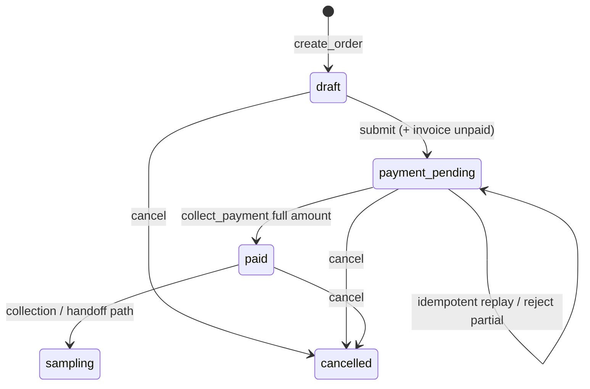

# Payment State Machine — Reception M2 Step 2

**Scope:** Reception / Business Engine (Stack A)  
**Source of truth:** `backend/app/business_engine/statuses.py`, `reception_workspace/service.py`, `business_engine/service.py`  
**No implementation in this step.**

---

## 1. End-to-end workflow (required path)

```text
Order (create)
    ↓
Calculate (line items → subtotal)
    ↓
Discount (order.discount)
    ↓
Insurance (NOT APPLIED — method label only at pay time)
    ↓
VAT (NOT APPLIED — tax always null)
    ↓
Grand Total (total_amount = max(subtotal − discount, 0))
    ↓
Payment (POST …/payment — full outstanding)
    ↓
Receipt (receipt_number on BizPayment + client print)
    ↓
Order Paid (order.status = paid, invoice.status = paid)
    ↓
Laboratory Queue (lab-handoff — requires paid; barcodes also require paid)
```

---

## 2. Order status transitions (BizOrder)

From `ORDER_TRANSITIONS`:

```text
draft ──────────────────────► payment_pending ──► paid ──► sampling ──► …
  │                              │                  │
  └──────────► cancelled ◄───────┴──────────────────┘
```

| From | To | Trigger (existing) |
|------|----|--------------------|
| `draft` | `payment_pending` | `submit_order_for_payment` (inside `create_reception_order`) |
| `draft` | `cancelled` | Cancel path (if used) |
| `payment_pending` | `paid` | `mark_order_paid` via `collect_payment` |
| `payment_pending` | `cancelled` | Cancel path |
| `paid` | `sampling` | Collection / handoff flows |
| `paid` | `cancelled` | Allowed by transition table |

**Payable statuses for `mark_order_paid`:** `payment_pending` or `draft` (draft auto-submits then pays). Already `paid` returns existing payment.

---

## 3. Invoice status

```text
unpaid ──(mark_order_paid)──► paid
```

One invoice per order (`create_invoice_from_order` is idempotent on existing).

---

## 4. Payment summary status (computed, not a column)

```text
paid_amount <= 0                    → unpaid
outstanding > 0 and paid_amount > 0 → partial   (reported; collect rejects creating this)
outstanding <= 0 OR order.status=paid → paid
```

**Collect rules:**

| Condition | Result |
|-----------|--------|
| amount ≤ 0 | Error |
| amount > outstanding | Error (overpayment) |
| amount < outstanding | Error (**partial not supported**) |
| amount ≈ outstanding | Success → order/invoice paid |
| Idempotency key hit | Replay success (`idempotent_replay: true`) |
| Already paid | Replay existing payment |

---

## 5. Reception queue workflow (parallel)

```text
… → PAYMENT_PENDING ──(collect)──► PAID ──► … (sampling / completed)
```

| Event | `payment_status` | `workflow_status` |
|-------|------------------|-------------------|
| Order created | `PENDING` (when queue linked) | `PAYMENT_PENDING` |
| Payment collected | `PAID` | `PAID` |

---

## 6. Post-paid gates (downstream M2 domains)

| Action | Guard (existing code) |
|--------|------------------------|
| Barcode / QR / request-form | Order must be **paid** |
| Lab handoff | Order must be **paid** (or beyond in lab statuses) |

```text
paid ──► [documents: barcode/QR/requisition] ──► lab-handoff ──► lab_received / testing …
```

---

## 7. Ideal vs actual calculation path

| Step | Ideal (product narrative) | Actual today |
|------|---------------------------|--------------|
| Calculate | Sum lines | Yes — `_recalc_order_totals` |
| Discount | Applied | Yes — float |
| Insurance | Cover / co-pay | **Skipped** — only tender type later |
| VAT | Add tax | **Skipped** — `tax: null` |
| Grand total | subtotal − discount + VAT | **subtotal − discount only** |
| Payment | Full or partial | **Full only** |
| Receipt | Persist document | **Number + client print** |
| Order paid | State flip | Yes |
| Lab queue | Handoff | Yes (separate API after paid) |

---

## 8. State diagram (payment-focused)



---

## 9. Non-states (not implemented on Stack A)

- `refunded` / `void` on BizPayment  
- `waived` balance write-off  
- Insurance adjudicated → reduced outstanding  
- VAT-inclusive total  
- Multi-tender split payment items  
