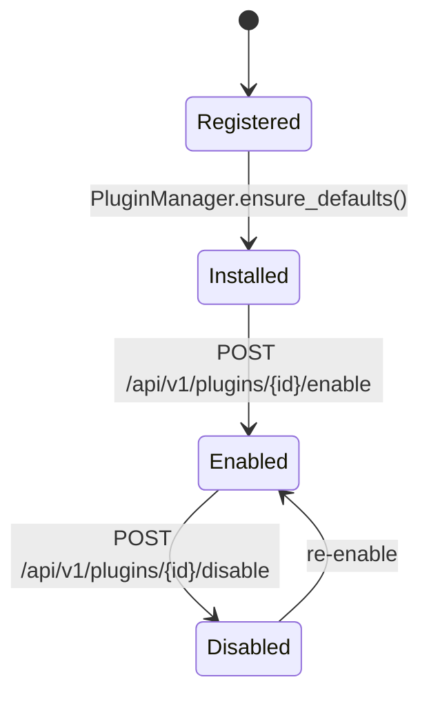

# DxCon Plugin SDK Guide

**Phase 7.2 · Marketplace Platform**

This guide explains how to build, register, install, and operate plugins on the DxCon Marketplace Platform.

---

## 1. Overview

DxCon plugins extend the diagnostic platform without modifying core workflows. The plugin framework lives in `backend/app/plugins/` and is surfaced through:

- **Legacy API:** `/api/v1/plugins/*`
- **Phase 7.2 Hub:** `/marketplace-platform/*` and `/api/v1/marketplace-platform/*`

---

## 2. Plugin anatomy

| Component | Module | Purpose |
|---|---|---|
| **PluginBase** | `plugin_base.py` | Abstract lifecycle: `on_enable`, `on_disable`, `health_check` |
| **PluginManifest** | `plugin_manifest.py` | Metadata: id, name, version, config schema, dependencies |
| **PluginRegistry** | `plugin_registry.py` | In-memory manifest + class registration |
| **PluginManager** | `plugin_manager.py` | Persistence via `IntegrationPluginState` |

---

## 3. Creating a plugin

### Step 1 — Define manifest

```python
from app.plugins.plugin_manifest import PluginManifest

manifest = PluginManifest(
    plugin_id="my-integration",
    name="My Integration Plugin",
    version="1.0.0",
    description="Syncs orders to external CRM",
    config_schema={
        "api_key": {"required": True, "type": "string"},
        "endpoint": {"required": True, "type": "string"},
    },
    dependencies=["event-bridge"],
)
```

### Step 2 — Implement plugin class

```python
from app.plugins.plugin_base import PluginBase

class MyIntegrationPlugin(PluginBase):
    def on_enable(self):
        self.enabled = True
        return {"status": "ENABLED"}

    def on_disable(self):
        self.enabled = False
        return {"status": "DISABLED"}

    def health_check(self):
        return {"status": "OK" if self.enabled else "DISABLED", "plugin_id": self.plugin_id}
```

### Step 3 — Register at startup

```python
from app.plugins.plugin_registry import PluginRegistry

PluginRegistry.register(manifest, MyIntegrationPlugin)
```

---

## 4. Installation lifecycle



| Stage | API | Description |
|---|---|---|
| **Register** | Internal | Manifest + class in `PluginRegistry` |
| **Install** | `PluginManager.ensure_defaults()` | Creates `IntegrationPluginState` row |
| **Enable** | `POST /api/v1/plugins/{id}/enable` | Validates config, calls `on_enable()` |
| **Disable** | `POST /api/v1/plugins/{id}/disable` | Calls `on_disable()` |
| **Health** | `GET /api/v1/marketplace-platform/health` | Aggregated health checks |

---

## 5. Permissions

Each plugin declares required permissions in the Phase 7.2 hub:

| Plugin | Permissions |
|---|---|
| `webhook-delivery` | `webhook:write`, `webhook:read`, `event:deliver` |
| `event-bridge` | `event:read`, `event:write`, `integration:admin` |
| `adapter-sync` | `adapter:read`, `adapter:write`, `queue:write` |

Custom plugins should document permissions in their manifest description and request only the scopes they need.

---

## 6. Sandbox testing

Validate plugin config before enable:

```bash
curl -X POST /api/v1/plugins/webhook-delivery/validate-config \
  -H "Content-Type: application/json" \
  -d '{"config": {"endpoint_url": "https://example.com/hook", "secret": "test"}}'
```

Phase 7.2 sandbox hub runs sample configs:

```bash
curl /api/v1/marketplace-platform/sandbox
```

---

## 7. Versioning

- Plugin version is semver string in manifest (`1.0.0`)
- Stored in `IntegrationPluginState.version`
- View all versions: `GET /api/v1/marketplace-platform/versions`

Breaking changes require a new `plugin_id` or major version bump with migration notes.

---

## 8. Dependencies

Declare dependencies in manifest:

```python
dependencies=["event-bridge", "adapter-sync"]
```

View dependency graph: `GET /api/v1/marketplace-platform/dependencies`

The installer should verify dependencies are enabled before activating a dependent plugin.

---

## 9. Default plugins

| Plugin ID | Purpose |
|---|---|
| `webhook-delivery` | Signed webhook payload delivery |
| `event-bridge` | Domain event bridge to external systems |
| `adapter-sync` | Adapter health and queue synchronization |

---

## 10. Hub routes (Phase 7.2)

| Feature | Web | API |
|---|---|---|
| Marketplace | `/marketplace-platform/marketplace` | `/api/v1/marketplace-platform/marketplace` |
| Plugin Registry | `/marketplace-platform/registry` | `/api/v1/marketplace-platform/registry` |
| Plugin Manifest | `/marketplace-platform/manifest` | `/api/v1/marketplace-platform/manifest` |
| Plugin Installer | `/marketplace-platform/installer` | `/api/v1/marketplace-platform/installer` |
| Plugin Version | `/marketplace-platform/versions` | `/api/v1/marketplace-platform/versions` |
| Plugin Dependency | `/marketplace-platform/dependencies` | `/api/v1/marketplace-platform/dependencies` |
| Plugin Permission | `/marketplace-platform/permissions` | `/api/v1/marketplace-platform/permissions` |
| Plugin Sandbox | `/marketplace-platform/sandbox` | `/api/v1/marketplace-platform/sandbox` |
| Plugin Health | `/marketplace-platform/health` | `/api/v1/marketplace-platform/health` |

---

## 11. Verification

```bash
DATABASE_URL=sqlite:///:memory: python3 backend/scripts/verify_marketplace_platform.py
```

Report: `backend/generated_release/MARKETPLACE_PLATFORM_REPORT.json`

---

## 12. Backward compatibility

- Legacy `/marketplace` booking and search flows are unchanged
- Legacy `/api/v1/plugins` enable/disable/validate routes remain active
- New hub is additive; no breaking API changes

---

*For tenant-scoped plugin deployment, combine with Phase 7.1 Multi Tenant Foundation.*
