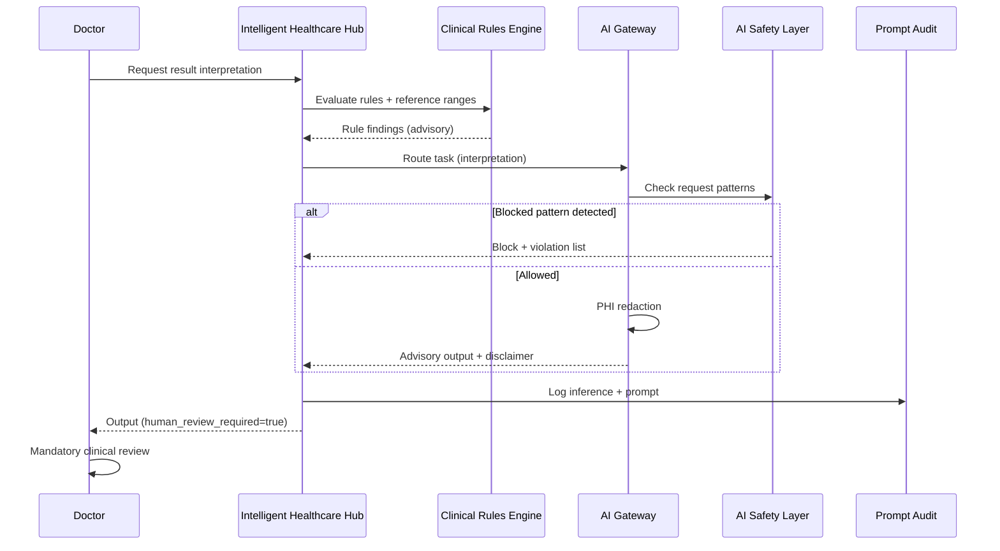
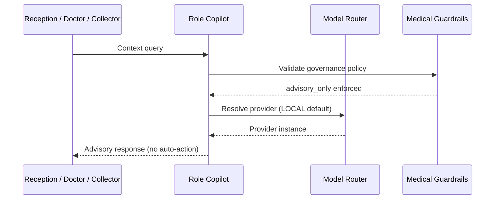
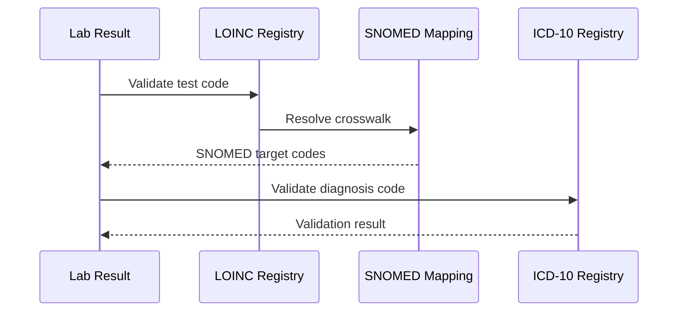
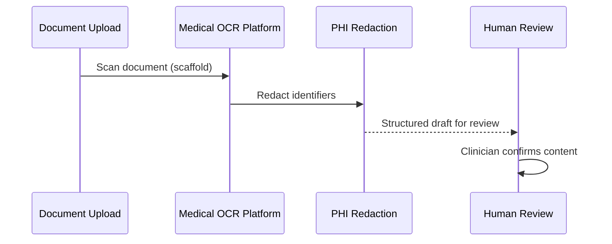

# AI Sequence Diagrams — Phase 8

## Clinical Interpretation Flow

```mermaid
sequenceDiagram
    participant Doctor
    participant Hub as Intelligent Healthcare Hub
    participant CDS as Clinical Rules Engine
    participant AI as AI Gateway
    participant Safety as AI Safety Layer
    participant Audit as Prompt Audit

    Doctor->>Hub: Request result interpretation
    Hub->>CDS: Evaluate rules + reference ranges
    CDS-->>Hub: Rule findings (advisory)
    Hub->>AI: Route task (interpretation)
    AI->>Safety: Check request patterns
    alt Blocked pattern detected
        Safety-->>Hub: Block + violation list
    else Allowed
        AI->>AI: PHI redaction
        AI-->>Hub: Advisory output + disclaimer
    end
    Hub->>Audit: Log inference + prompt
    Hub-->>Doctor: Output (human_review_required=true)
    Doctor->>Doctor: Mandatory clinical review
```

## Copilot Advisory Flow

```mermaid
sequenceDiagram
    participant User as Reception / Doctor / Collector
    participant Copilot as Role Copilot
    participant Router as Model Router
    participant Guard as Medical Guardrails

    User->>Copilot: Context query
    Copilot->>Guard: Validate governance policy
    Guard-->>Copilot: advisory_only enforced
    Copilot->>Router: Resolve provider (LOCAL default)
    Router-->>Copilot: Provider instance
    Copilot-->>User: Advisory response (no auto-action)
```

## Terminology Mapping Flow

```mermaid
sequenceDiagram
    participant Lab as Lab Result
    participant LOINC as LOINC Registry
    participant SNOMED as SNOMED Mapping
    participant ICD as ICD-10 Registry

    Lab->>LOINC: Validate test code
    LOINC->>SNOMED: Resolve crosswalk
    SNOMED-->>Lab: SNOMED target codes
    Lab->>ICD: Validate diagnosis code
    ICD-->>Lab: Validation result
```

## OCR Scaffold Flow (Future)

```mermaid
sequenceDiagram
    participant Upload as Document Upload
    participant OCR as Medical OCR Platform
    participant PHI as PHI Redaction
    participant Review as Human Review

    Upload->>OCR: Scan document (scaffold)
    OCR->>PHI: Redact identifiers
    PHI-->>Review: Structured draft for review
    Review->>Review: Clinician confirms content
```
