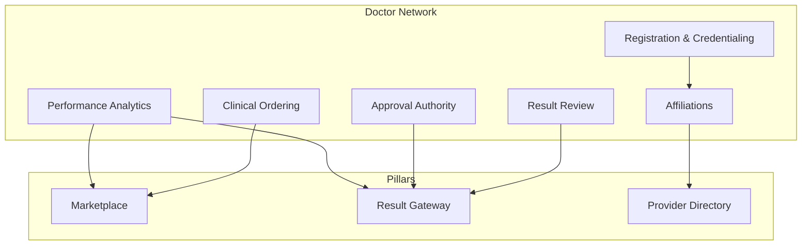
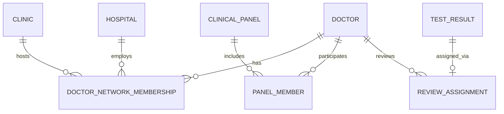
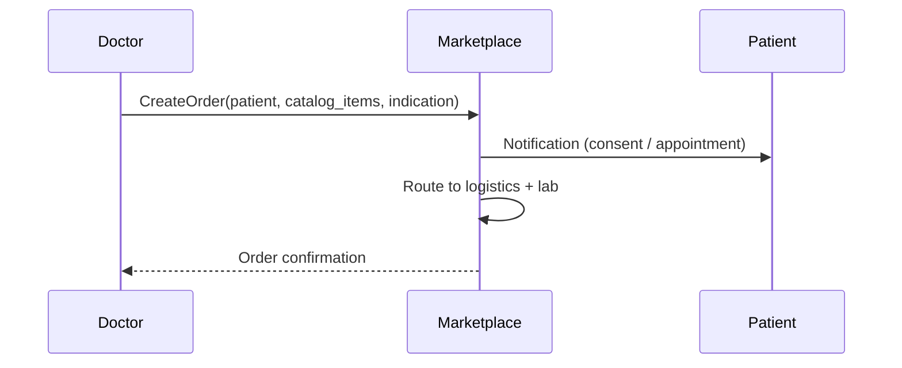
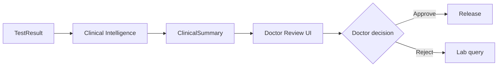

# Doctor Network Architecture

| Field | Value |
|---|---|
| **Document ID** | ARCH-DOC-001 |
| **RFC** | RFC-0001 |
| **Version** | 1.0.0 |
| **Status** | Baseline |
| **Last updated** | 2026-06-26 |

---

## 1. Purpose

The **Doctor Network** defines how physicians and clinical authorities interact with the DxCon Intelligent Diagnostic Services Platform.

Doctors are not passive result recipients. They are **clinical gatekeepers** in the Result Gateway, **ordering agents** in the Marketplace, and **members** of an extensible professional network serving patients, clinics, and hospitals.

---

## 2. Position in platform architecture



---

## 3. Doctor as platform actor

| Role | Responsibility | Platform surface |
|---|---|---|
| **Ordering physician** | Initiates diagnostic orders with clinical indication | Marketplace / doctor portal |
| **Reviewing physician** | Validates results before patient release | Result Gateway / doctor portal |
| **Panel physician** | Backup reviewer for network coverage | Doctor Network routing |
| **Hospital affiliating physician** | Orders under enterprise contract | B2B + doctor portal |

DxCon does **not** employ doctors. The network connects **independent and affiliated physicians** to platform workflows.

---

## 4. Network membership model

### 4.1 Entities (target)

| Entity | Description |
|---|---|
| Doctor | Licensed physician profile (extends User) |
| DoctorNetworkMembership | Link to clinic, hospital, or independent practice |
| ClinicalPanel | Group of doctors sharing review load |
| ReviewAssignment | Maps pending result → assigned doctor |

**Current state:** Doctor identity implied via `User.role = DOCTOR`; no formal Doctor entity or membership tables.

### 4.2 Membership types

| Type | Description |
|---|---|
| Independent | Solo practice; self-assigned reviews |
| Clinic-affiliated | Member of clinic panel; shared patients |
| Hospital-employed | Hospital routing rules apply |
| Locum / backup | Receives overflow review assignments |



---

## 5. Credentialing and onboarding

| Step | Verification | Platform action |
|---|---|---|
| Identity verification | Government ID | User account creation |
| Medical license | License number, jurisdiction | Doctor profile flag `LICENSED` |
| Specialty | Board certification (optional) | Panel routing tags |
| Affiliation | Clinic/hospital letter | Membership record |
| Platform training | Result Gateway policy ack | Enable review permissions |

**Status:** Manual onboarding in v1; self-service credentialing portal in v2.

---

## 6. Clinical ordering workflow



| Data captured | Purpose |
|---|---|
| Clinical indication | Medical necessity audit |
| Priority | Urgent vs routine routing |
| Preferred lab | Contract-aware routing override |

**Current:** Orders creatable via web; doctor-specific ordering API planned.

---

## 7. Result review workflow

### 7.1 Review queue

Doctors access pending results via:

- Web: `/doctor` dashboard
- Future: `/api/v1/doctor/review-queue` mobile-optimized

Queue sorted by:

1. Critical flags first
2. Oldest waiting
3. Doctor's own patients prioritized

### 7.2 Review decision matrix

| Result flag | AI summary | Typical action |
|---|---|---|
| CRITICAL | Any | Immediate approve or call patient |
| HIGH | Risk MEDIUM+ | Review + approve with note |
| NORMAL | Risk LOW | Batch approve eligible |
| AMENDED | Prior version exists | Compare + approve new version |

### 7.3 Approval record

Approval creates `ResultAuthorization`:

```
result_id, doctor_id, approved_at, approval_note, policy_version
```

**Current gap:** Web approve link mutates result without persistent authorization record — see Domain Model v2.

---

## 8. AI-assisted review (human-in-the-loop)



Doctors see:

- Raw result values and flags
- AI-generated plain-language summary (advisory)
- Historical results for patient (future)
- Order clinical indication

Doctors **must** explicitly approve. AI cannot release autonomously.

---

## 9. Routing and coverage

### 9.1 Primary assignment

```
IF order.ordering_doctor_id IS NOT NULL
  ASSIGN review TO ordering_doctor
ELSE IF patient.primary_care_doctor_id IS NOT NULL
  ASSIGN review TO primary_care_doctor
ELSE
  ASSIGN review TO clinical_panel.default_reviewer
```

### 9.2 Escalation

| Trigger | Escalation |
|---|---|
| No action in 24h | Notify panel backup |
| Critical unreviewed in 1h | Ops alert + SMS doctor |
| Doctor suspended | Reassign to panel |

---

## 10. Doctor KPI and analytics

**Current module:** `doctor_kpi` web dashboard

| KPI | Definition |
|---|---|
| Review TAT | Time from INGESTED to APPROVED |
| Approval rate | Approved / total reviewed |
| Rejection rate | Rejected / total reviewed |
| Patient panel size | Active patients under care |
| Order volume | Orders placed per period |

KPIs support network quality management and partner SLAs.

---

## 11. API surface (current → target)

| Operation | Current | Target |
|---|---|---|
| Review queue | Web `/doctor` | `GET /api/v1/doctor/review-queue` |
| Approve result | Web `/doctor/approve/<id>` | `POST /api/v1/doctor/results/<id>/approve` |
| Reject result | — | `POST /api/v1/doctor/results/<id>/reject` |
| Place order | Web orders | `POST /api/v1/doctor/orders` |
| List patients | — | `GET /api/v1/doctor/patients` |
| KPI | Web `/doctor/kpi` | `GET /api/v1/doctor/kpi` |

All endpoints require `DOCTOR` JWT with scoped patient access.

---

## 12. Privacy and access control

| Rule | Enforcement |
|---|---|
| Doctor sees only assigned or affiliated patients | Row-level scope on queries |
| Review notes are clinical records | Encrypted at rest; audit on access |
| Doctor suspension revokes review permissions | Immediate token invalidation |
| Break-glass access | Admin audit for emergency access |

---

## 13. Integration points

| System | Integration |
|---|---|
| Result Gateway | Review queue, approval, release trigger |
| Marketplace | Doctor-initiated orders |
| Provider Directory | Affiliation and panel membership |
| Partner Ecosystem | Doctor as demand-side partner type |
| Patient mobile | Notification when results released post-approval |

---

## 14. Roadmap

| Phase | Capability |
|---|---|
| v1 | Web portal review and approve |
| v2 | Doctor API + mobile review app |
| v3 | Panel routing, escalation automation |
| v4 | EMR integration (FHIR DiagnosticReport) |

---

## 15. Related documents

- [RESULT_GATEWAY.md](RESULT_GATEWAY.md)
- [PARTNER_ECOSYSTEM.md](PARTNER_ECOSYSTEM.md)
- [PROVIDER_DIRECTORY.md](PROVIDER_DIRECTORY.md)
- [MARKETPLACE_ARCHITECTURE.md](MARKETPLACE_ARCHITECTURE.md)
- [RFC-0001-DXCON-PLATFORM.md](../rfc/RFC-0001-DXCON-PLATFORM.md)

---

*The Doctor Network ensures diagnostic results receive appropriate clinical oversight before reaching patients.*
