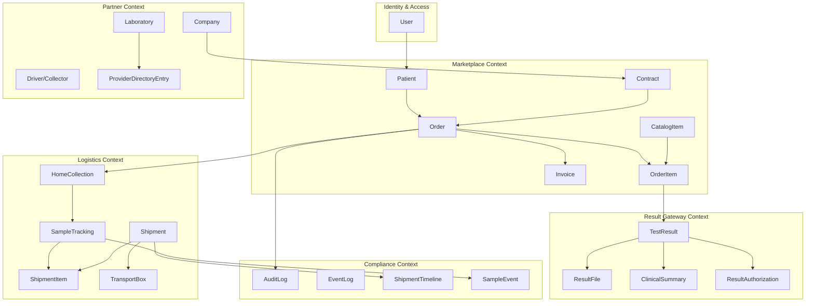
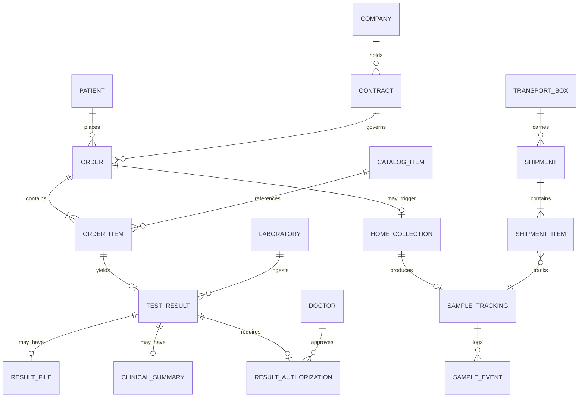

# Domain Model v2

| Field | Value |
|---|---|
| **Document ID** | ARCH-DOMAIN-002 |
| **RFC** | RFC-0001 |
| **Version** | 2.0.0 |
| **Status** | Baseline |
| **Supersedes** | Implicit v1 model (scattered SQLAlchemy models) |
| **Last updated** | 2026-06-26 |

---

## 1. Purpose

Domain Model v2 defines the **canonical entity model** for the DxCon Intelligent Diagnostic Services Platform.

This model organizes entities into **bounded contexts** aligned with Marketplace, Logistics, Result Gateway, and Partner Management. It maps to existing SQLAlchemy models where present and identifies **target entities** for evolution.

---

## 2. Bounded contexts



---

## 3. Core aggregates

### 3.1 Marketplace aggregate: Diagnostic Order

**Aggregate root:** `Order`

| Entity | Role | Current model |
|---|---|---|
| Order | Commercial diagnostic request | `Order` |
| OrderItem | Line item referencing catalog test | `OrderItem` |
| Contract | B2B pricing context | `Contract` |
| ContractPrice | Price per catalog item per contract | `ContractPrice` |
| Invoice | Billing document | `Invoice` |
| Payment | Settlement record | `Payment` |

**Invariants:**

- Every `OrderItem` references a `CatalogItem` (Master Service Catalog)
- Order status progresses: `PENDING → CONFIRMED → IN_FULFILLMENT → COMPLETED → CLOSED`
- Financial events are idempotent

### 3.2 Logistics aggregate: Specimen Journey

**Aggregate root:** `Shipment` (box-level) or `SampleTracking` (sample-level)

| Entity | Role | Current model |
|---|---|---|
| HomeCollection | Patient booking / collection appointment | `HomeCollection` |
| SampleTracking | Individual specimen state | `SampleTracking` |
| SampleEvent | Sample-level timeline | `SampleEvent` |
| Shipment | Transport unit to lab | `Shipment` |
| ShipmentItem | Sample membership in shipment | `ShipmentItem` |
| ShipmentTimeline | Shipment compliance timeline | `ShipmentTimeline` |
| TransportBox | Cold chain container | `TransportBox` |
| Driver | Field collector identity | `Driver` |

**Invariants:**

- Specimen cannot enter `TESTING` without lab receive evidence
- Shipment status: `CREATED → ACCEPTED → IN_TRANSIT → ARRIVED → RECEIVED → ...`
- Every state transition writes AuditLog + EventLog (+ ShipmentTimeline for shipments)

### 3.3 Result Gateway aggregate: Clinical Result

**Aggregate root:** `TestResult`

| Entity | Role | Current model |
|---|---|---|
| TestResult | Structured result value | `TestResult` |
| ResultFile | PDF/image artifact | `ResultFile` |
| ClinicalSummary | AI-assisted interpretation | `ClinicalSummary` |
| ResultAuthorization | **Target** — release gate record | *New entity* |

**Invariants:**

- Result is `INGESTED → UNDER_REVIEW → APPROVED → RELEASED → ACCESSED`
- Patient visibility requires `ResultAuthorization` with doctor/platform approval
- AI output is advisory; never auto-releases to patient

### 3.4 Partner aggregate: Provider

**Aggregate root:** `ProviderDirectoryEntry` (**target**; today fragmented across `Laboratory`, `Company`, `Driver`)

| Entity | Role | Current model |
|---|---|---|
| Company | Legal entity / B2B party | `Company` |
| Laboratory | Lab partner profile | `Laboratory` |
| Driver | Collector profile | `Driver` |
| ProviderDirectoryEntry | Unified directory row | *Target consolidation* |

---

## 4. Entity catalog

### 4.1 Identity & access

| Entity | Key attributes | Notes |
|---|---|---|
| User | id, email, role, password_hash | Auth identity |
| Patient | id, full_name, phone, patient_code | Clinical subject; linked to User by phone/email |

### 4.2 Marketplace

| Entity | Key attributes | Notes |
|---|---|---|
| CatalogItem | code, name, category, specimen_type, TAT SLA | See [MASTER_SERVICE_CATALOG.md](MASTER_SERVICE_CATALOG.md) |
| Order | order_code, patient_id, status, contract_id | |
| OrderItem | order_id, catalog_item_id, test_name, status | |
| Company | name, tax_id, type | B2B party |
| Contract | company_id, lab_id, effective_dates | |
| ContractPrice | contract_id, catalog_item_id, price | |
| Invoice | order_id, amount, status | |
| Payment | invoice_id, method, status | |

**Current mapping:** `TestCatalog` → migrate to `CatalogItem` semantics.

### 4.3 Logistics

| Entity | Key attributes | Notes |
|---|---|---|
| HomeCollection | patient_id, address, scheduled_time, collector_id, status | |
| SampleTracking | sample_code, status, collector_id, transport_box_id, lat/lng | |
| Shipment | shipment_code, status, collector_id, transport_box_id, gps | |
| ShipmentItem | shipment_id, sample_code, order_item_id | |
| TransportBox | box_code, status, temperature, battery, lat/lng | |
| Driver | driver_code, full_name, vehicle_no | Collector identity |

### 4.4 Result Gateway

| Entity | Key attributes | Notes |
|---|---|---|
| TestResult | order_item_id, result_value, flag, status | |
| ResultFile | order_id, file_path, mime_type | |
| ClinicalSummary | order_id, summary_text, risk_level | AI assist |
| ResultAuthorization | result_id, approved_by, approved_at, release_policy | **Target** |

### 4.5 Compliance (cross-cutting)

| Entity | Key attributes | Notes |
|---|---|---|
| AuditLog | action, object_type, object_id, user_email | Security/compliance audit |
| EventLog | event_type, object_type, object_id, message | Platform events |
| ShipmentTimeline | shipment_id, event_type, actor, gps | Chain of custody |
| SampleEvent | sample_tracking_id, event_type, note | Sample timeline |
| Alert | type, severity, status | Ops monitoring |
| Incident | type, description, resolution | Ops incidents |

### 4.6 CRM & ops (supporting)

| Entity | Current model |
|---|---|
| CrmLead | `CrmLead` |
| DispatchJob / DispatchItem | `DispatchJob`, `DispatchItem` |

---

## 5. Key relationships



**Note:** v1 codebase uses string UUID references without FK constraints. v2 target adds referential integrity via migrations.

---

## 6. Status machines (canonical)

### 6.1 Order (Marketplace)

```
PENDING → CONFIRMED → IN_FULFILLMENT → COMPLETED → CLOSED
                   ↘ CANCELLED
```

### 6.2 Sample (Logistics)

```
CHECKED_IN → IN_TRANSIT → RECEIVED → PROCESSING → COMPLETED
```

### 6.3 Shipment (Logistics)

```
CREATED → ACCEPTED → IN_TRANSIT → ARRIVED → RECEIVED → TESTING → COMPLETED
```

### 6.4 Test result (Result Gateway)

```
INGESTED → UNDER_REVIEW → APPROVED → RELEASED → ACCESSED
                       ↘ AMENDED → UNDER_REVIEW
```

### 6.5 Transport box

```
ONLINE → IN_USE → IN_TRANSIT → RETURNING → ONLINE
```

---

## 7. v1 → v2 migration map

| v1 model / concept | v2 canonical entity | Action |
|---|---|---|
| `TestCatalog` | `CatalogItem` | Rename semantics; centralize in Master Service Catalog |
| `Laboratory` | `ProviderDirectoryEntry` (type=LAB) | Consolidate into directory |
| `Driver` | `ProviderDirectoryEntry` (type=COLLECTOR) | Consolidate |
| `HomeSampling` (orphan) | Deprecate or merge into `HomeCollection` | Remove duplicate |
| Doctor (web only) | `Doctor` entity + `DoctorNetworkMembership` | Formalize |
| Release approval (web action) | `ResultAuthorization` | Persist gate record |
| Inline order test names | `CatalogItem` reference on `OrderItem` | Enforce catalog FK |

---

## 8. Domain events (target)

| Event | Context | Triggers |
|---|---|---|
| `OrderPlaced` | Marketplace | Route to collection/logistics |
| `CollectionScheduled` | Logistics | Notify collector |
| `ShipmentAccepted` | Logistics | Compliance log |
| `LabReceived` | Logistics | Notify lab partner |
| `ResultIngested` | Result Gateway | Queue doctor review |
| `ResultApproved` | Result Gateway | Enable patient release |
| `ResultReleased` | Result Gateway | Notify patient |

Implementation target: `EventLog` today; event bus (v3) for partner webhooks.

---

## 9. Data classification

| Classification | Examples | Retention |
|---|---|---|
| PHI | Patient name, results, addresses | Regulatory minimum + contract |
| PII | User email, phone | Account lifetime + grace |
| Operational | Shipment status, box temperature | 7 years (configurable) |
| Financial | Invoice, payment | 10 years |
| Audit | AuditLog, timelines | Immutable; 7+ years |

---

## 10. Related documents

- [RFC-0001-DXCON-PLATFORM.md](../rfc/RFC-0001-DXCON-PLATFORM.md)
- [MASTER_SERVICE_CATALOG.md](MASTER_SERVICE_CATALOG.md)
- [PROVIDER_DIRECTORY.md](PROVIDER_DIRECTORY.md)
- [LOGISTICS_CHAIN_OF_CUSTODY.md](LOGISTICS_CHAIN_OF_CUSTODY.md)
- [RESULT_GATEWAY.md](RESULT_GATEWAY.md)

---

*Domain Model v2 is the target state. Incremental alignment preserves backward compatibility per RFC-0001 principles.*
