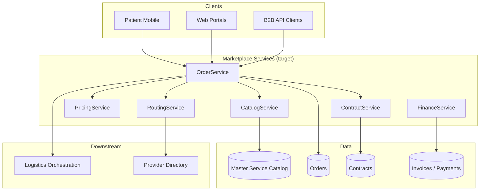
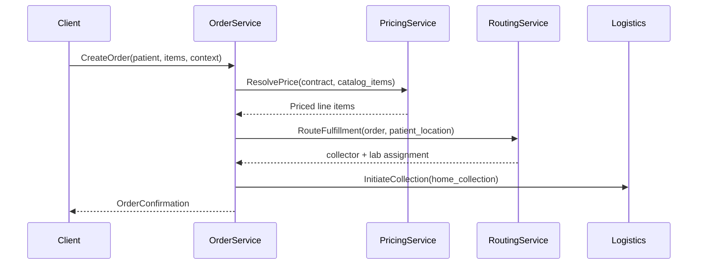
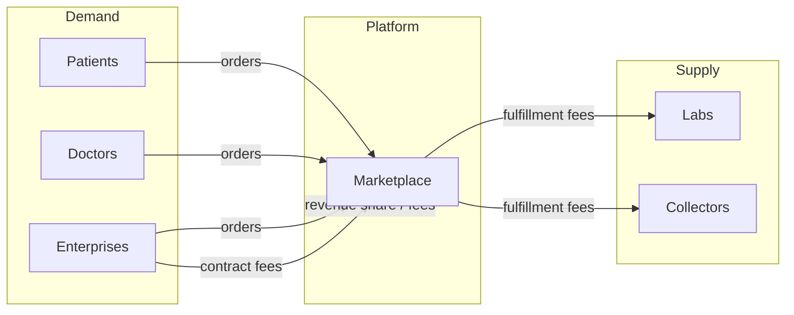

# Marketplace Architecture

| Field | Value |
|---|---|
| **Document ID** | ARCH-MKT-001 |
| **RFC** | RFC-0001 |
| **Version** | 1.0.0 |
| **Status** | Baseline |
| **Last updated** | 2026-06-26 |

---

## 1. Purpose

The **Marketplace** is the commercial orchestration pillar of DxCon. It enables discovery, ordering, contracting, and fulfillment initiation for diagnostic services across the partner ecosystem.

The Marketplace **does not execute laboratory tests**. It creates governed commercial intent and routes fulfillment to Logistics and Laboratory Partners.

---

## 2. Scope

### 2.1 In scope

- Master Service Catalog exposure and search
- Patient, doctor, clinic, and hospital ordering
- B2B contracts and dynamic pricing
- Order lifecycle management
- Invoice and payment initiation
- Provider selection via Provider Directory
- Routing orders to collection and lab partners

### 2.2 Out of scope

- Specimen transport (Logistics pillar)
- Result ingestion and release (Result Gateway pillar)
- Laboratory analytical workflows (partner LIS)
- EMR clinical documentation

---

## 3. Architecture overview



---

## 4. Core capabilities

### 4.1 Catalog discovery

| Capability | Description |
|---|---|
| Browse by category | Biochemistry, hematology, microbiology, panels |
| Search | Code, name, synonym, ICD-aligned tags (future) |
| Filter | Specimen type, TAT, partner availability |
| Panel composition | Bundled catalog items |

**Source of truth:** [MASTER_SERVICE_CATALOG.md](MASTER_SERVICE_CATALOG.md)

**Current API:** `/api/v1/test-catalogs`

### 4.2 Order placement



**Order channels:**

| Channel | Actor | Current surface |
|---|---|---|
| Patient self-order | Patient | `/api/v1/mobile`, patient portal |
| Doctor-ordered | Doctor | Doctor portal, future API |
| Clinic bulk | Clinic staff | Web orders, B2B API |
| Hospital panel | Hospital admin | Contracts + orders |

**Current API:** `/api/v1/orders`, `/api/v1/order-items`

### 4.3 Contract and pricing

| Concept | Description |
|---|---|
| Enterprise contract | Company ↔ platform ↔ lab routing rules |
| Contract price | Per-catalog-item negotiated price |
| List price | Default catalog price without contract |
| Dynamic routing | Select lab by contract, geography, TAT |

**Current models:** `Company`, `Contract`, `ContractPrice`  
**Current service:** `pricing.py` (extend to full PricingService)

### 4.4 Financial flow

```
Order CONFIRMED
  → Invoice generated (on fulfillment trigger or completion)
    → Payment captured / receivable recorded
      → Partner settlement (future)
```

**Current API:** `/api/v1/invoices`, `/api/v1/payments`, `/api/v1/invoices/generate/<order_id>`

---

## 5. Order state machine

```
PENDING ──confirm──▶ CONFIRMED ──fulfill──▶ IN_FULFILLMENT ──complete──▶ COMPLETED ──▶ CLOSED
   │                    │
   └──── cancel ────────┴──── cancel ────▶ CANCELLED
```

| State | Marketplace responsibility |
|---|---|
| PENDING | Validate catalog, patient, pricing |
| CONFIRMED | Reserve routing; notify logistics |
| IN_FULFILLMENT | Track downstream logistics + lab status |
| COMPLETED | All items have terminal result or cancellation |
| CLOSED | Financial reconciliation complete |

---

## 6. Routing logic

RoutingService selects fulfillment partners using Provider Directory:

| Input | Routing decision |
|---|---|
| Patient address | Collection network coverage |
| Catalog item | Lab capability mapping |
| Active contract | Approved lab panel |
| TAT requirement | Fastest eligible lab |
| Load balancing | Partner capacity (future) |

Output: `assigned_collector_id`, `assigned_lab_id`, `expected_tat`.

**Current state:** Manual assignment via workflow APIs; target automated routing.

---

## 7. API surface (current → target)

| Capability | Current endpoint | Target service |
|---|---|---|
| List catalog | `GET /api/v1/test-catalogs` | CatalogService.list |
| Create order | `POST /api/v1/orders` | OrderService.create |
| Order items | `POST /api/v1/order-items` | OrderService.addItem |
| Contracts | `/api/v1/contracts/*` | ContractService |
| Pricing | Inline in routes | PricingService |
| Dashboard | `GET /api/v1/dashboard/summary` | MarketplaceAnalytics |

**Versioning:** Non-breaking changes on `/api/v1`; breaking changes require `/api/v2` with deprecation period.

---

## 8. Multi-sided marketplace dynamics



DxCon may charge:

- Platform transaction fee per order
- Subscription for enterprise buyers
- Logistics coordination fee
- Result gateway fee per release

Billing implementation extends existing `Invoice` / `Payment` models.

---

## 9. Integration with other pillars

| Pillar | Handoff | Data passed |
|---|---|---|
| **Logistics** | `InitiateCollection` | Order ID, patient address, items, specimen requirements |
| **Provider Directory** | `ResolveProviders` | Location, catalog items, contract |
| **Result Gateway** | Order completion callback | Order item IDs for result matching |
| **Doctor Network** | Doctor-initiated orders | Doctor ID, clinical indication (future) |

---

## 10. Non-functional requirements

| NFR | Target |
|---|---|
| Availability | 99.9% API uptime |
| Order idempotency | Client-supplied idempotency key |
| Catalog cache | CDN / Redis for catalog reads |
| Audit | All order mutations → AuditLog |
| PCI | Payment tokenization via partner (future) |

---

## 11. Current codebase alignment

| Component | Path | Gap |
|---|---|---|
| Orders API | `api/orders/routes.py` | Logic in routes; needs OrderService |
| Catalog | `api/test_catalogs/routes.py` | Not yet Master Catalog semantics |
| Contracts | `api/contracts/routes.py` | Functional |
| Pricing | `services/pricing.py` | Partial |
| Web UI | `web/orders.py`, `web/contracts.py` | Inline HTML |

---

## 12. Related documents

- [MASTER_SERVICE_CATALOG.md](MASTER_SERVICE_CATALOG.md)
- [PROVIDER_DIRECTORY.md](PROVIDER_DIRECTORY.md)
- [PARTNER_ECOSYSTEM.md](PARTNER_ECOSYSTEM.md)
- [DOMAIN_MODEL_V2.md](DOMAIN_MODEL_V2.md)
- [RFC-0001-DXCON-PLATFORM.md](../rfc/RFC-0001-DXCON-PLATFORM.md)

---

*The Marketplace creates commercial intent and routes fulfillment. Execution belongs to partners and downstream pillars.*
