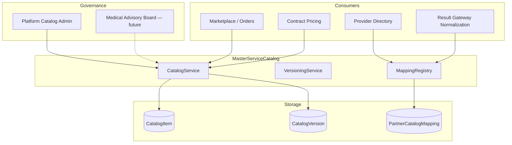
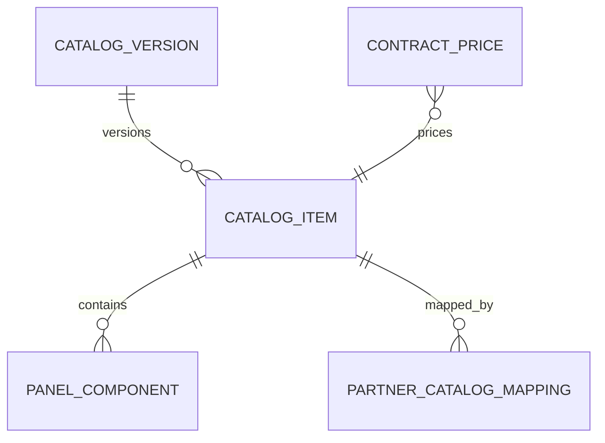
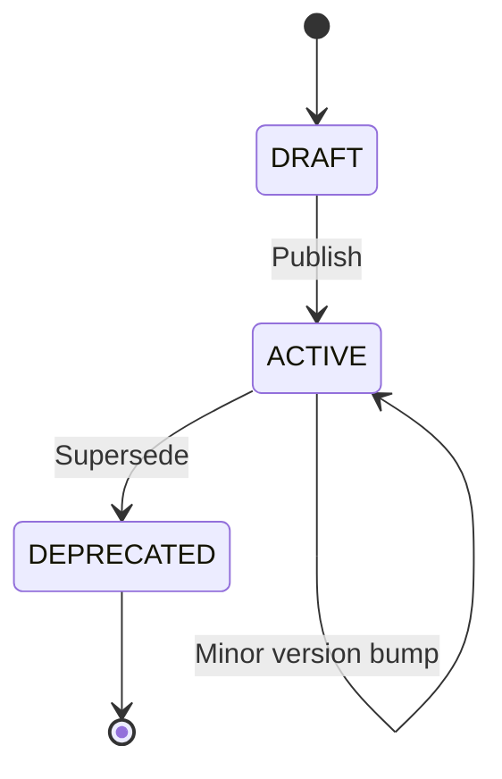
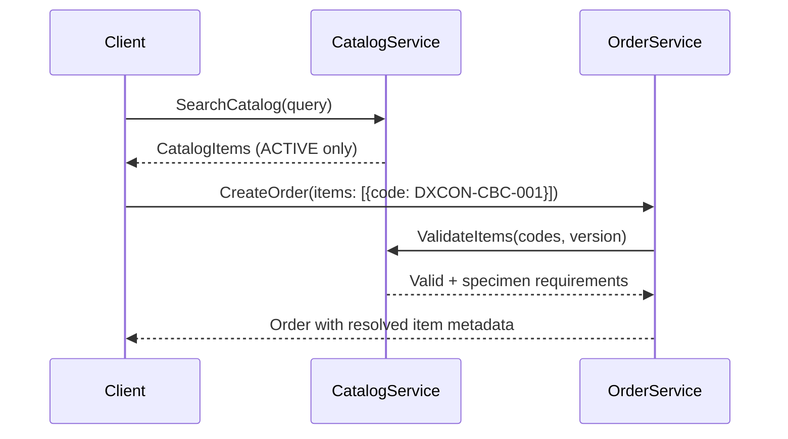

# Master Service Catalog Architecture

| Field | Value |
|---|---|
| **Document ID** | ARCH-MSC-001 |
| **RFC** | RFC-0001 |
| **Version** | 1.0.0 |
| **Status** | Baseline |
| **Last updated** | 2026-06-26 |

---

## 1. Purpose

The **Master Service Catalog (MSC)** is the canonical registry of diagnostic services offered through the DxCon Marketplace.

It is the **single source of truth** for:

- What tests and panels can be ordered
- Specimen requirements and preparation instructions
- Default turnaround time (TAT) expectations
- Clinical categorization and search metadata
- Mapping targets for Laboratory Partner local codes

The MSC **does not** define how a laboratory performs a test internally. It defines the **platform-visible service contract**.

---

## 2. Design principles

| Principle | Description |
|---|---|
| **Canonical codes** | Every orderable item has a unique `DXCON-*` code |
| **Versioned entries** | Catalog changes are versioned; orders pin to catalog version |
| **Partner mapping** | Labs map local codes to MSC codes; orders never use local codes directly |
| **Composable panels** | Panels reference component catalog items |
| **Separation from pricing** | Catalog defines service; contracts define price |
| **Regulatory metadata** | LOINC alignment (target), specimen type, fasting requirements |

---

## 3. Architecture



---

## 4. Catalog item model

### 4.1 CatalogItem (canonical)

| Field | Type | Description |
|---|---|---|
| `code` | string | Unique ID, e.g. `DXCON-CBC-001` |
| `name` | string | Display name |
| `category` | enum | HEMATOLOGY, BIOCHEMISTRY, MICROBIOLOGY, IMMUNOLOGY, MOLECULAR, PANEL, IMAGING |
| `specimen_type` | enum | BLOOD, SERUM, PLASMA, URINE, SWAB, STOOL, TISSUE |
| `container_type` | string | EDTA, SST, urine cup, etc. |
| `fasting_required` | boolean | Patient preparation |
| `tat_hours` | integer | Standard turnaround SLA |
| `status` | enum | ACTIVE, DEPRECATED, DRAFT |
| `version` | integer | Catalog version when item last changed |
| `loinc_code` | string | Target LOINC alignment (optional) |
| `synonyms` | string[] | Search aliases |
| `description` | text | Patient-facing description |

### 4.2 Panel item

| Field | Description |
|---|---|
| `panel_components` | List of `{ catalog_item_code, required }` |
| `panel_pricing_rule` | Sum of components or bundled price (contract-level) |



---

## 5. Code namespace convention

| Prefix | Meaning | Example |
|---|---|---|
| `DXCON-{CATEGORY}-{SEQ}` | Single test | `DXCON-CBC-001` |
| `DXCON-PANEL-{SEQ}` | Panel bundle | `DXCON-PANEL-001` |
| `DXCON-IMG-{SEQ}` | Imaging service (future) | `DXCON-IMG-001` |

Categories (abbreviated):

| Code segment | Category |
|---|---|
| CBC, CHEM, MICRO, IMM, MOL | Clinical disciplines |
| PANEL | Composite panels |
| IMG | Imaging (future) |

---

## 6. Catalog lifecycle



| Transition | Rule |
|---|---|
| DRAFT → ACTIVE | Admin publish; medical review (future) |
| ACTIVE → DEPRECATED | Superseded by new code; existing orders unaffected |
| In-flight orders | Pin to catalog version at order creation |

---

## 7. Partner catalog mapping

Laboratory Partners use local test codes internally. The **Mapping Registry** translates at gateway boundaries:

| MSC code | Lab partner | Local code | Local name |
|---|---|---|---|
| DXCON-CBC-001 | Lab ABC | LAB-HEM-001 | Complete Blood Count |
| DXCON-GLU-FAST | Lab ABC | LAB-CHEM-042 | Fasting Glucose |

**Used by:**

- Result Gateway normalization on ingest
- Marketplace routing (lab capability by mapped items)
- Provider Directory lab capability matrix

---

## 8. API surface

### 8.1 Current implementation

| Operation | Endpoint | Model |
|---|---|---|
| List tests | `GET /api/v1/test-catalogs` | `TestCatalog` |
| Create test | `POST /api/v1/test-catalogs` | `TestCatalog` |

### 8.2 Target MSC API

| Operation | Endpoint |
|---|---|
| List catalog (paginated) | `GET /api/v1/catalog/items` |
| Get item by code | `GET /api/v1/catalog/items/{code}` |
| Search | `GET /api/v1/catalog/search?q=` |
| List panels | `GET /api/v1/catalog/panels` |
| Admin publish | `POST /api/v1/catalog/admin/publish` |
| Partner mapping | `GET/POST /api/v1/catalog/mappings` |

**Migration:** `TestCatalog` records gain MSC fields; codes normalized to `DXCON-*` namespace.

---

## 9. Marketplace integration



Order items store `catalog_item_code` + `catalog_version` — not free-text test names.

**Current gap:** `OrderItem.test_name` is free text; target enforces catalog reference.

---

## 10. Result Gateway integration

On result ingest:

```
1. Lab sends local_code + result payload
2. MappingRegistry resolves local_code → MSC code
3. NormalizationService validates against order item catalog reference
4. TestResult stored with canonical catalog_item_code
```

Ensures patient-facing results use consistent naming regardless of executing lab.

---

## 11. Contract pricing integration

```
ContractPrice.contract_id + catalog_item_code → price
```

Pricing never references lab local codes. Enterprise contracts specify approved MSC item subsets (panels).

**Current model:** `ContractPrice` linked to contract — extend with `catalog_item_code`.

---

## 12. Search and discovery

| Search dimension | Index fields |
|---|---|
| Text | name, synonyms, description |
| Category | category enum |
| Specimen | specimen_type |
| Availability | labs offering item (via Provider Directory) |
| TAT | tat_hours range |

Target: PostgreSQL full-text search v1; Elasticsearch v3 for scale.

---

## 13. Governance

| Role | Permission |
|---|---|
| Platform catalog admin | Create, publish, deprecate |
| Medical advisor | Approve clinical metadata (future) |
| Lab partner | Propose mappings; cannot alter MSC |
| Enterprise buyer | View contracted subset only |

All catalog mutations → `AuditLog`.

---

## 14. Sample catalog entries (reference)

| Code | Name | Category | Specimen | TAT (h) |
|---|---|---|---|---|
| DXCON-CBC-001 | Complete Blood Count | HEMATOLOGY | BLOOD (EDTA) | 24 |
| DXCON-GLU-FAST-001 | Fasting Glucose | BIOCHEMISTRY | SERUM (SST) | 24 |
| DXCON-HBA1C-001 | HbA1c | BIOCHEMISTRY | BLOOD (EDTA) | 48 |
| DXCON-LIPID-001 | Lipid Panel | BIOCHEMISTRY | SERUM (SST) | 24 |
| DXCON-PANEL-001 | General Health Panel | PANEL | Multiple | 48 |

---

## 15. Related documents

- [MARKETPLACE_ARCHITECTURE.md](MARKETPLACE_ARCHITECTURE.md)
- [PROVIDER_DIRECTORY.md](PROVIDER_DIRECTORY.md)
- [RESULT_GATEWAY.md](RESULT_GATEWAY.md)
- [DOMAIN_MODEL_V2.md](DOMAIN_MODEL_V2.md)
- [RFC-0001-DXCON-PLATFORM.md](../rfc/RFC-0001-DXCON-PLATFORM.md)

---

*The Master Service Catalog is the lingua franca of the DxCon diagnostic network — what can be ordered, fulfilled, and delivered, independent of any single laboratory.*
