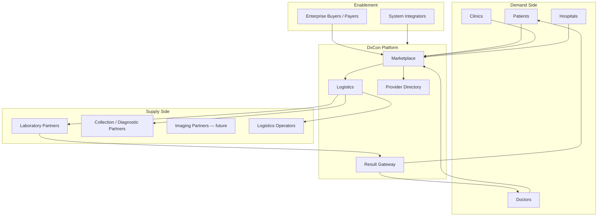
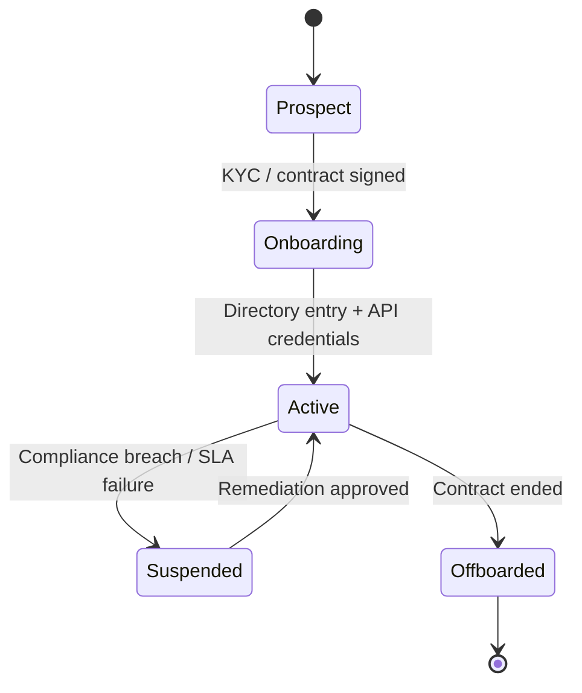
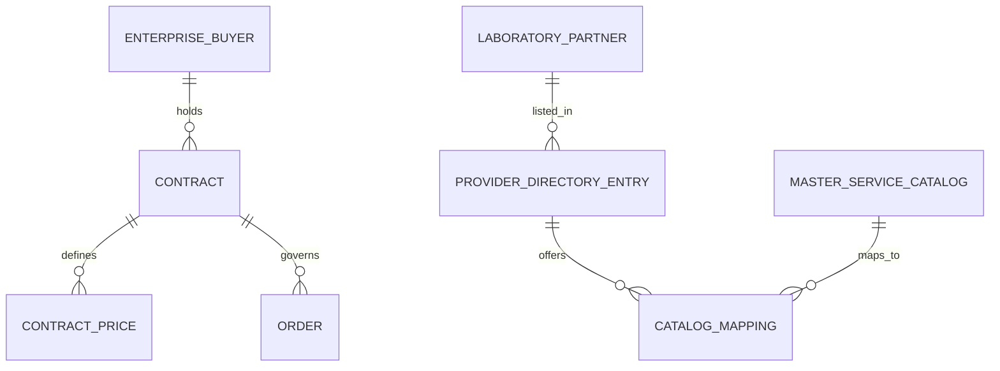

# Partner Ecosystem Architecture

| Field | Value |
|---|---|
| **Document ID** | ARCH-PARTNER-001 |
| **RFC** | RFC-0001 |
| **Version** | 1.0.0 |
| **Status** | Baseline |
| **Last updated** | 2026-06-26 |

---

## 1. Purpose

This document defines the **Partner Ecosystem** for the DxCon Intelligent Diagnostic Services Platform (IDSP).

DxCon operates a **multi-sided network**. Each partner type has distinct capabilities, obligations, and API surfaces. The platform orchestrates interactions; partners retain domain sovereignty in their operational systems.

---

## 2. Ecosystem overview

---

## 3. Partner taxonomy

| Partner type | Role | Platform relationship | Primary pillar |
|---|---|---|---|
| **Patient** | Service consumer | Orders tests, receives released results | Marketplace + Result Gateway |
| **Doctor** | Clinical authority | Orders, reviews, approves result release | Marketplace + Doctor Network + Result Gateway |
| **Clinic** | Care site | Bulk ordering, staff workflows, referral | Marketplace |
| **Hospital** | Enterprise care org | Contracts, panels, routing rules | Marketplace + Provider Directory |
| **Laboratory Partner** | Execution partner | Performs tests; returns results to gateway | Result Gateway (ingest) |
| **Diagnostic Partner** | Field / collection network | Home collection, specimen handoff | Logistics |
| **Logistics Operator** | Transport / cold chain | Shipments, boxes, GPS evidence | Logistics |
| **Enterprise Buyer** | B2B contract holder | Pricing, SLAs, approved catalogs | Marketplace |
| **System Integrator** | Technical partner | API integration, white-label (future) | All pillars |

**Critical distinction:** A Laboratory Partner is a **supplier** connected through APIs and directory entries. DxCon is **not** the laboratory's internal operating system.

---

## 4. Partner lifecycle

| Stage | Platform actions |
|---|---|
| **Prospect** | CRM lead (`CrmLead`); no production access |
| **Onboarding** | Provider Directory entry; role provisioning; catalog mapping |
| **Active** | Full API access per contract; SLA monitoring |
| **Suspended** | Read-only results; no new orders routed |
| **Offboarded** | Data retention per policy; credentials revoked |

---

## 5. Roles and capabilities matrix

| Capability | Patient | Doctor | Clinic | Hospital | Lab | Collector | Logistics | Admin |
|---|---|---|---|---|---|---|---|---|
| Browse catalog | ✓ | ✓ | ✓ | ✓ | — | — | — | ✓ |
| Place order | ✓ | ✓ | ✓ | ✓ | — | — | — | ✓ |
| Assign collection | — | ✓ | ✓ | ✓ | — | ✓ | ✓ | ✓ |
| Accept shipment | — | — | — | — | — | ✓ | ✓ | ✓ |
| Upload results | — | — | — | — | ✓ | — | — | ✓ |
| Review / approve results | — | ✓ | — | ✓* | — | — | — | ✓ |
| View released results | ✓ | ✓ | ✓** | ✓** | — | — | — | ✓ |
| Manage contracts | — | — | ✓ | ✓ | ✓ | — | — | ✓ |

\* Hospital may delegate approval to employed physicians  
\** Scoped to organization patients only

Current codebase roles (`User.role`): `PATIENT`, `DOCTOR`, `COLLECTOR`, `SUPER_ADMIN` — extend to `LAB`, `LOGISTICS`, `CLINIC_ADMIN`, `HOSPITAL_ADMIN` per this matrix.

---

## 6. Commercial relationships

| Relationship | Description |
|---|---|
| **Enterprise contract** | B2B pricing and approved test panels for clinics/hospitals |
| **Lab service agreement** | Lab commits to TAT, result format, and ingest SLA |
| **Collection network agreement** | Diagnostic partner commits to coverage area and collection SLA |
| **Logistics SLA** | Cold chain compliance, evidence capture |

Existing models: `Company`, `Contract`, `ContractPrice`, `Invoice`, `Payment`.

---

## 7. Integration patterns by partner type

### 7.1 Laboratory Partner

| Direction | Mechanism | Data |
|---|---|---|
| Inbound (DxCon → Lab) | Order notification, specimen manifest | Order items, patient demographics (min necessary) |
| Outbound (Lab → DxCon) | Result Gateway ingest API | Structured results, PDF, abnormal flags |
| Status | Webhook or polling | TESTING, COMPLETED |

Lab retains LIS. DxCon receives **gateway payloads** only.

### 7.2 Diagnostic Partner (Collector)

| Direction | Mechanism | Data |
|---|---|---|
| Mobile / API | `/api/v1/collector/*` | Job assignment, accept shipment, start trip |
| Evidence | GPS placeholder → device GPS | Location, timestamps |
| Handoff | QR scan at lab | Chain-of-custody closure |

Reference: FP-003 collector workflow, [LOGISTICS_CHAIN_OF_CUSTODY.md](LOGISTICS_CHAIN_OF_CUSTODY.md).

### 7.3 Doctor

| Direction | Mechanism | Data |
|---|---|---|
| Portal | Web doctor portal | Pending results queue |
| Approval | Approve action → Result Gateway | Release authorization |
| Network | [DOCTOR_NETWORK.md](DOCTOR_NETWORK.md) | Affiliations, panels |

### 7.4 Clinic / Hospital

| Direction | Mechanism | Data |
|---|---|---|
| B2B portal | Web + API | Bulk orders, department routing |
| Directory | [PROVIDER_DIRECTORY.md](PROVIDER_DIRECTORY.md) | Site locations, default labs |

---

## 8. Trust and compliance boundaries

| Boundary | Platform responsibility | Partner responsibility |
|---|---|---|
| Specimen integrity | Logistics orchestration, QR, audit trail | Proper collection technique |
| Test execution | Order routing, TAT tracking | Analytical validity (lab) |
| Result accuracy | Ingest validation, format checks | Clinical correctness (lab) |
| Result release | Gateway gate, audit | Clinical review (doctor) |
| Patient consent | Consent capture (target) | Referral appropriateness (doctor) |
| Billing | Invoice generation | Contractual pricing accuracy |

---

## 9. Partner data isolation

| Data class | Visibility rule |
|---|---|
| Patient PHI | Patient + treating doctor + authorized org staff |
| Order details | Ordering party + assigned partners on need-to-know |
| Specimen logistics | Collectors, logistics, receiving lab only |
| Raw lab results | Lab + doctor review queue until released |
| Released results | Patient + ordering doctor |
| B2B pricing | Contract parties only |

---

## 10. Ecosystem KPIs

| KPI | Partner types | Pillar |
|---|---|---|
| Order fulfillment rate | All supply partners | Marketplace |
| Collection SLA adherence | Diagnostic partners | Logistics |
| Cold chain compliance | Logistics operators | Logistics |
| Lab TAT | Laboratory partners | Result Gateway |
| Result release TAT | Doctor network | Result Gateway |
| Patient result access rate | Platform | Result Gateway |
| Contract revenue | Enterprise buyers | Marketplace |

Existing dashboards: `executive_v9`, `tat_kpi`, `collector_kpi`, `doctor_kpi`.

---

## 11. Roadmap: ecosystem expansion

| Phase | Capability |
|---|---|
| **v1 (current)** | Core partner types; manual onboarding; web portals |
| **v2** | Self-service partner portal; API keys; webhook subscriptions |
| **v3** | Imaging partners; multi-lab routing; payer integration |
| **v4** | Cross-border partners; regional data residency |

---

## 12. Related documents

- [RFC-0001-DXCON-PLATFORM.md](../rfc/RFC-0001-DXCON-PLATFORM.md)
- [PROVIDER_DIRECTORY.md](PROVIDER_DIRECTORY.md)
- [DOCTOR_NETWORK.md](DOCTOR_NETWORK.md)
- [MARKETPLACE_ARCHITECTURE.md](MARKETPLACE_ARCHITECTURE.md)

---

*DxCon connects partners; it does not replace partner operational systems.*
