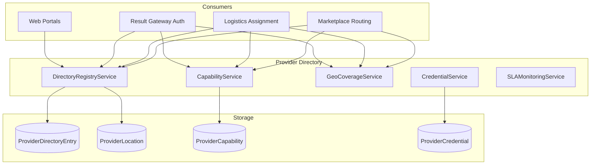
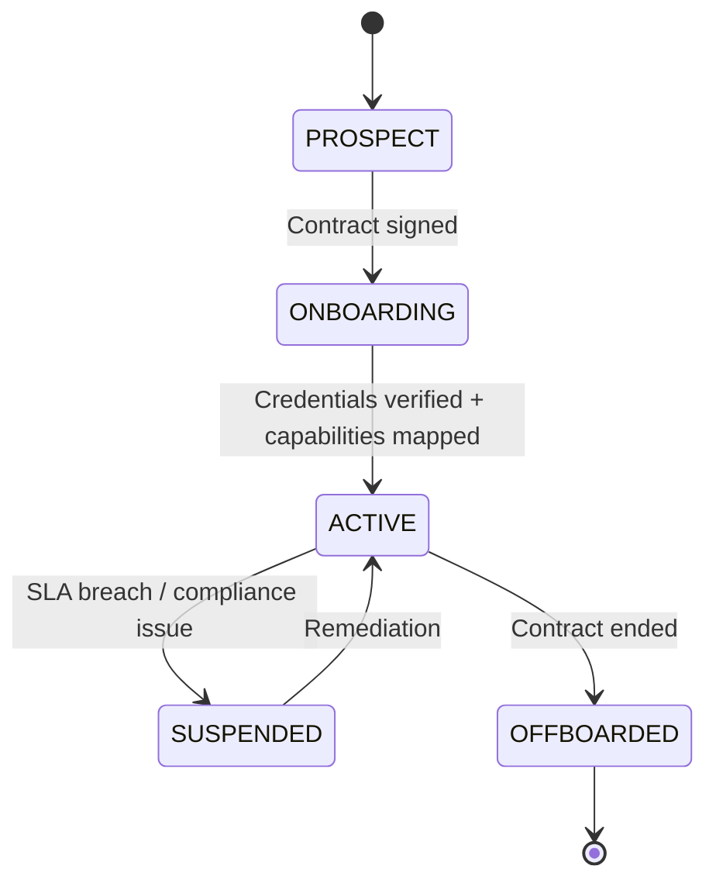
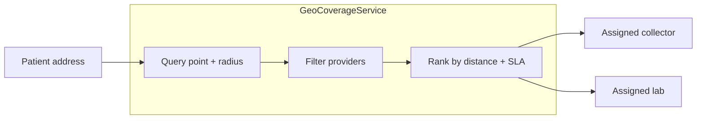

# Provider Directory Architecture

| Field | Value |
|---|---|
| **Document ID** | ARCH-PD-001 |
| **RFC** | RFC-0001 |
| **Version** | 1.0.0 |
| **Status** | Baseline |
| **Last updated** | 2026-06-26 |

---

## 1. Purpose

The **Provider Directory** is the authoritative registry of all supply-side and service partners on the DxCon platform.

It answers:

- **Who** can fulfill a diagnostic service?
- **Where** do they operate?
- **What** catalog items can they execute or collect?
- **How** are they contracted and credentialed?

The Provider Directory enables Marketplace routing, Logistics assignment, and Result Gateway ingest authorization.

---

## 2. Scope

### 2.1 Registered provider types

| Type | Code | Description |
|---|---|---|
| Laboratory Partner | `LAB` | Executes tests; ingests results |
| Collection Partner | `COLLECTOR` | Field / home sample collection |
| Logistics Operator | `LOGISTICS` | Transport and cold chain |
| Clinic | `CLINIC` | Demand-side care site (directory for routing) |
| Hospital | `HOSPITAL` | Enterprise care organization |
| Imaging Center | `IMAGING` | Future diagnostic imaging partner |

### 2.2 Out of scope

- Patient registry (Patient entity in Marketplace context)
- Doctor credentialing detail (see [DOCTOR_NETWORK.md](DOCTOR_NETWORK.md))
- Master Service Catalog definitions (see [MASTER_SERVICE_CATALOG.md](MASTER_SERVICE_CATALOG.md))

---

## 3. Architecture



---

## 4. Directory entry model

### 4.1 ProviderDirectoryEntry (target canonical)

| Field | Type | Description |
|---|---|---|
| `id` | UUID | Primary key |
| `provider_code` | string | Unique, e.g. `LAB-HN-001`, `COL-DEMO-001` |
| `provider_type` | enum | LAB, COLLECTOR, LOGISTICS, CLINIC, HOSPITAL |
| `legal_name` | string | Registered entity name |
| `display_name` | string | Patient-facing name |
| `status` | enum | PROSPECT, ONBOARDING, ACTIVE, SUSPENDED, OFFBOARDED |
| `company_id` | UUID | Link to `Company` (B2B entity) |
| `contact_email` | string | Operations contact |
| `contact_phone` | string | |
| `created_at` | datetime | |

### 4.2 ProviderLocation

| Field | Description |
|---|---|
| `provider_id` | Parent directory entry |
| `location_type` | HQ, COLLECTION_SITE, LAB_SITE, DEPOT |
| `address` | Full address |
| `latitude`, `longitude` | Geo coordinates |
| `service_radius_km` | Coverage radius for collectors |
| `operating_hours` | Schedule JSON |

### 4.3 ProviderCapability

| Field | Description |
|---|---|
| `provider_id` | Directory entry |
| `catalog_item_code` | MSC reference |
| `capability_type` | EXECUTE (lab), COLLECT (specimen), TRANSPORT |
| `tat_override_hours` | Optional partner-specific TAT |
| `max_daily_volume` | Capacity limit (future) |

### 4.4 ProviderCredential

| Field | Description |
|---|---|
| `provider_id` | Directory entry |
| `credential_type` | LICENSE, ACCREDITATION, INSURANCE, API_KEY |
| `identifier` | License number, cert ID |
| `expires_at` | Renewal tracking |
| `verified_at` | Platform verification timestamp |

---

## 5. v1 codebase mapping

Current fragmented models consolidate into Provider Directory:

| Current model | Directory type | Notes |
|---|---|---|
| `Laboratory` | `LAB` | Test execution partner |
| `Driver` | `COLLECTOR` | Field collector (`driver_code`) |
| `Company` | Legal entity | B2B parent for contracts |
| `TransportBox` | Logistics asset | Linked to LOGISTICS provider |
| Web `drivers` module | COLLECTOR admin | CRUD UI |

**Target migration:** Introduce `ProviderDirectoryEntry` as facade; existing tables become type-specific extensions or views.

---

## 6. Provider lifecycle



| Stage | Directory behavior |
|---|---|
| PROSPECT | Visible to admin only; CRM lead link |
| ONBOARDING | Capability mapping in progress; no order routing |
| ACTIVE | Eligible for Marketplace and Logistics routing |
| SUSPENDED | No new assignments; existing orders complete |
| OFFBOARDED | Historical reference only; credentials revoked |

Aligns with [PARTNER_ECOSYSTEM.md](PARTNER_ECOSYSTEM.md) lifecycle.

---

## 7. Routing integration

### 7.1 Marketplace lab routing

```
RoutingService.selectLab(order):
  candidates = DirectoryRegistry.findActive(type=LAB)
  candidates = CapabilityService.filter(candidates, order.catalog_items)
  candidates = GeoCoverageService.filter(candidates, patient.location)
  candidates = ContractService.filter(candidates, order.contract)
  return rank_by_tat_and_load(candidates)[0]
```

### 7.2 Logistics collector assignment

```
AssignmentService.selectCollector(home_collection):
  candidates = DirectoryRegistry.findActive(type=COLLECTOR)
  candidates = GeoCoverageService.filter(candidates, collection.address)
  return nearest_available(candidates)
```

**Current:** Manual assignment via `/api/v1/workflow/assign/<booking>/<collector>`.

### 7.3 Result Gateway ingest authorization

```
IngestService.authorize(lab_id, catalog_item_code):
  entry = DirectoryRegistry.get(lab_id)
  assert entry.status == ACTIVE
  assert CapabilityService.has(entry, catalog_item_code, EXECUTE)
```

Prevents unauthorized labs from ingesting results for catalog items they are not credentialed to perform.

---

## 8. Geographic coverage model



| Provider type | Coverage mechanism |
|---|---|
| COLLECTOR | `service_radius_km` from collection sites |
| LAB | Accepts samples from defined regions or nationally |
| LOGISTICS | Depot locations + route corridors |

---

## 9. Capability matrix (example)

| Provider | Type | MSC codes | Capability |
|---|---|---|---|
| Lab ABC | LAB | DXCON-CBC-001, DXCON-GLU-FAST-001 | EXECUTE |
| Lab ABC | LAB | DXCON-PANEL-001 | EXECUTE (panel) |
| Collector Demo | COLLECTOR | DXCON-CBC-001, DXCON-GLU-FAST-001 | COLLECT |
| Logistics DxCon | LOGISTICS | * | TRANSPORT |

Panel capabilities expand to component items automatically.

---

## 10. API surface

### 10.1 Current endpoints (fragmented)

| Provider type | Endpoint | Model |
|---|---|---|
| Laboratories | `/api/v1/laboratories` | `Laboratory` |
| Collectors | `/api/v1/collector/collectors` | `Driver` |
| Companies | `/api/v1/companies` | `Company` |
| Transport boxes | `/api/v1/transport-boxes` | `TransportBox` |

### 10.2 Target unified directory API

| Operation | Endpoint |
|---|---|
| Search providers | `GET /api/v1/directory/providers?type=&status=&geo=` |
| Get provider | `GET /api/v1/directory/providers/{id}` |
| List capabilities | `GET /api/v1/directory/providers/{id}/capabilities` |
| Add capability | `POST /api/v1/directory/admin/providers/{id}/capabilities` |
| Verify credential | `POST /api/v1/directory/admin/providers/{id}/credentials/verify` |
| Resolve routing | `POST /api/v1/directory/routing/resolve` |

**Backward compatibility:** Existing endpoints remain as aliases during migration.

---

## 11. Web administration

| Current page | Purpose | Target |
|---|---|---|
| `/drivers` | Collector CRUD | Directory admin (COLLECTOR) |
| `/transport-boxes` | Box fleet management | Logistics assets |
| Web companies | B2B entity admin | Company linkage |
| `/logistics` | Logistics dashboard | Directory + ops view |

Target: unified `/directory` admin portal with type filters.

---

## 12. SLA monitoring

| SLA metric | Provider type | Action on breach |
|---|---|---|
| Collection within window | COLLECTOR | Alert → Suspension review |
| Shipment delivery TAT | LOGISTICS | Alert |
| Result reporting TAT | LAB | Alert → Routing deprioritization |
| Cold chain compliance | LOGISTICS | Incident + Suspension |

**Current:** `tat_kpi`, `collector_kpi`, `dispatch_performance` dashboards — integrate with directory entry scores.

---

## 13. Security and access

| Actor | Directory access |
|---|---|
| Platform admin | Full CRUD |
| Lab partner | Own profile + capability proposals |
| Collector partner | Own profile + location updates |
| Enterprise buyer | View contracted providers only |
| Patient | View assigned provider display names only |

API credentials (`ProviderCredential` type=API_KEY) scoped to provider's own operations.

---

## 14. Related documents

- [PARTNER_ECOSYSTEM.md](PARTNER_ECOSYSTEM.md)
- [MASTER_SERVICE_CATALOG.md](MASTER_SERVICE_CATALOG.md)
- [MARKETPLACE_ARCHITECTURE.md](MARKETPLACE_ARCHITECTURE.md)
- [LOGISTICS_CHAIN_OF_CUSTODY.md](LOGISTICS_CHAIN_OF_CUSTODY.md)
- [RESULT_GATEWAY.md](RESULT_GATEWAY.md)
- [DOMAIN_MODEL_V2.md](DOMAIN_MODEL_V2.md)
- [RFC-0001-DXCON-PLATFORM.md](../rfc/RFC-0001-DXCON-PLATFORM.md)

---

*The Provider Directory is the routing backbone of the DxCon network — connecting demand to the right supply partner at the right place and time.*
