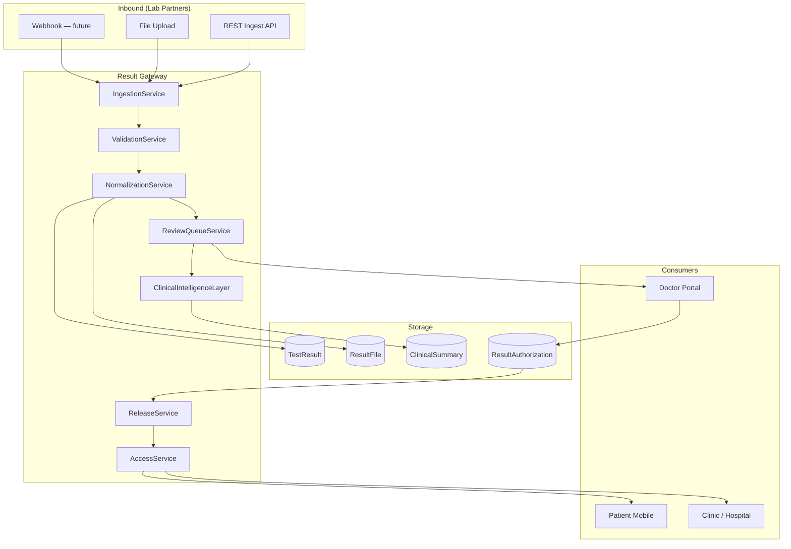
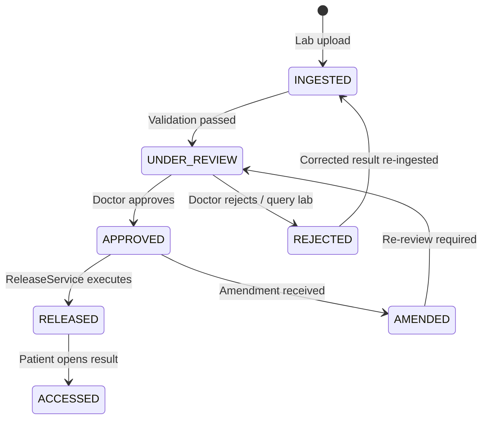
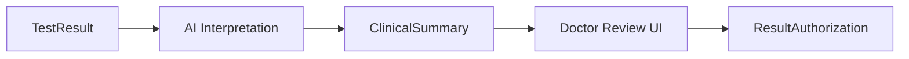

# Result Gateway Architecture

| Field | Value |
|---|---|
| **Document ID** | ARCH-RG-001 |
| **RFC** | RFC-0001 |
| **Version** | 1.0.0 |
| **Status** | Baseline |
| **Last updated** | 2026-06-26 |

---

## 1. Purpose

The **Result Gateway** is the clinical delivery pillar of DxCon. It ingests diagnostic results from Laboratory Partners, applies clinical governance, optionally enriches with AI assistance, and **controls release** to patients and authorized care teams.

DxCon is not a LIS. The Result Gateway is the **neutral boundary** where partner-produced results enter the platform network and become governed platform artifacts.

---

## 2. Core principle: governed release

```
Laboratory produces result (external)
  → Gateway INGESTS and validates
    → Doctor REVIEWS (Doctor Network)
      → Gateway RELEASES to patient
        → Patient ACCESSES via mobile/portal
```

**No direct lab-to-patient path.** The platform enforces clinical and policy gates.

---

## 3. Architecture overview



---

## 4. Result lifecycle

### 4.1 State machine



### 4.2 State definitions

| State | Description | Patient visible |
|---|---|---|
| INGESTED | Raw result received; pending validation | No |
| UNDER_REVIEW | In doctor review queue | No |
| APPROVED | Clinically authorized; pending release job | No |
| RELEASED | Available to patient per policy | Yes |
| ACCESSED | Patient has viewed (audit) | Yes |
| REJECTED | Held; lab correction requested | No |
| AMENDED | Superseded by correction | No (until re-released) |

---

## 5. Ingestion

### 5.1 Supported ingest channels

| Channel | Format | Current implementation |
|---|---|---|
| Structured API | JSON result payload | `POST /api/v1/test-results` |
| Document upload | PDF, image | `result_files`, `result_upload` web |
| Batch file | CSV/HL7 — future | Planned |

### 5.2 Ingestion payload (canonical)

```json
{
  "order_item_id": "uuid",
  "laboratory_id": "uuid",
  "catalog_item_code": "DXCON-CBC-001",
  "result_value": "12.5",
  "unit": "g/dL",
  "reference_range": "12.0-16.0",
  "flag": "NORMAL",
  "performed_at": "2026-06-26T10:00:00Z",
  "reported_at": "2026-06-26T14:00:00Z",
  "attachments": ["result_file_id"]
}
```

### 5.3 Validation rules

| Rule | Action on failure |
|---|---|
| Order item exists and is IN_FULFILLMENT | Reject ingest |
| Lab is authorized for catalog item | Reject ingest |
| Duplicate result for same order item | Idempotent return or AMENDED flow |
| Required fields present | Reject with error code |
| Flag values in allowed set | Normalize or reject |

---

## 6. Normalization

Laboratory Partners may use local codes. Normalization maps to Master Service Catalog:

| Lab local code | Catalog code | Mapping source |
|---|---|---|
| LAB-CBC-001 | DXCON-CBC-001 | Provider Directory catalog mapping |

Normalized results enable cross-lab analytics and consistent patient display.

---

## 7. Clinical review queue

### 7.1 Queue routing

| Rule | Assignee |
|---|---|
| Ordering doctor on record | Primary reviewer |
| Doctor unavailable | Panel backup (Doctor Network) |
| Hospital order | Hospital clinical lead |
| No doctor | Platform clinical ops (exception) |

**Current:** `doctor_portal` web dashboard lists pending results.

### 7.2 Review actions

| Action | Gateway effect |
|---|---|
| Approve | Create `ResultAuthorization`; transition to APPROVED |
| Reject | Notify lab; status REJECTED |
| Request clarification | Hold UNDER_REVIEW; notify lab |
| Escalate | Route to senior physician |

**Current:** `GET /doctor/approve/<result_id>` — target migration to API + `ResultAuthorization` entity.

---

## 8. Clinical Intelligence Layer (assistive)

The AI layer **assists** review; it does **not** replace physician judgment or auto-release results.



| Capability | API | Behavior |
|---|---|---|
| Single result interpret | `POST /api/v1/ai/interpret` | Rule-based flag explanation |
| Order-level analysis | `GET /api/v1/ai-v2/order/<id>` | Multi-result summary |
| Batch generation | `GET /api/v1/ai-v2/generate-all` | Ops batch (background target) |
| Risk scoring | `ai_risk_engine.py` | Advisory risk level |

**Services:** `ai_interpretation.py`, `ai_summary.py`, `ai_risk_engine.py`, `medical_summary.py`

**Governance:** AI output labeled "AI-assisted — not diagnostic"; stored in `ClinicalSummary`; never patient-visible until doctor approval.

---

## 9. Release service

### 9.1 Release policies

| Policy | Description |
|---|---|
| DOCTOR_REQUIRED | Default; requires ResultAuthorization |
| AUTO_RELEASE_NORMAL | Future; auto-release normal flags after N hours (configurable, high scrutiny) |
| ENTERPRISE_HOLD | Hospital policy holds all until batch release |

### 9.2 Release execution

```
ReleaseService.release(result_id):
  assert ResultAuthorization exists
  assert result.status == APPROVED
  transition to RELEASED
  write AuditLog (RESULT_RELEASED)
  notify patient (push/SMS — future)
  expose via /api/v1/patient/results/<patient_id>
```

**Gap (current codebase):** Patient APIs may return results without checking approval status — see ENGINEERING_BACKLOG BL-P1-010.

---

## 10. Access and audit

| Event | Logged to |
|---|---|
| Result ingested | AuditLog + EventLog |
| Doctor viewed | AuditLog |
| Doctor approved | AuditLog + ResultAuthorization |
| Result released | AuditLog + EventLog |
| Patient accessed | AuditLog |

Patient access creates `ACCESSED` state for compliance reporting.

---

## 11. API surface

| Operation | Current endpoint | Auth (target) |
|---|---|---|
| Ingest result | `POST /api/v1/test-results` | LAB JWT |
| Upload file | `POST /result-files/new` (web) | LAB / ADMIN |
| List pending (doctor) | `/doctor` web | DOCTOR session |
| Approve | `/doctor/approve/<id>` | DOCTOR session |
| Patient results | `/api/v1/patient/results/<id>` | PATIENT JWT + RELEASED filter |
| Download PDF | `/result-files/download/<id>` | Scoped token |

---

## 12. Integration with Logistics

Result Gateway receives fulfillment signal from Logistics:

```
Shipment status RECEIVED → TESTING
  → Lab partner executes (external)
    → Result Gateway INGESTED
```

Order item linkage via `order_item_id` connects commercial order to clinical result.

---

## 13. Error handling and amendments

| Scenario | Handling |
|---|---|
| Wrong patient | REJECTED; incident raised |
| Corrected result | New ingest → AMENDED supersedes prior |
| Critical value | Alert + expedited review queue |
| Partial panel | Release approved items; hold pending |

---

## 14. Non-functional requirements

| NFR | Target |
|---|---|
| Ingest latency | < 5s API response |
| Review queue freshness | Real-time web/mobile notification |
| Immutability | Released results append-only; amendments as new versions |
| Encryption | Result files at rest encrypted |
| Availability | 99.9% for patient result access |

---

## 15. Related documents

- [DOCTOR_NETWORK.md](DOCTOR_NETWORK.md)
- [MASTER_SERVICE_CATALOG.md](MASTER_SERVICE_CATALOG.md)
- [PROVIDER_DIRECTORY.md](PROVIDER_DIRECTORY.md)
- [DOMAIN_MODEL_V2.md](DOMAIN_MODEL_V2.md)
- [RFC-0001-DXCON-PLATFORM.md](../rfc/RFC-0001-DXCON-PLATFORM.md)

---

*The Result Gateway protects patients by ensuring laboratory output becomes clinically governed platform output before release.*
