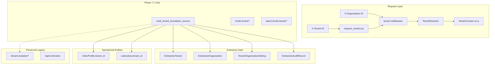

# Tenant Architecture

| Field | Value |
|---|---|
| **Document ID** | ARCH-TENANT-001 |
| **Phase** | 7.1 Multi Tenant Foundation |
| **Version** | 2.0.0 |
| **Status** | Baseline |
| **Last updated** | 2026-07-05 |

---

## 1. Purpose

Phase 7.1 establishes the **Multi Tenant Foundation** for DxCon Platform Ecosystem 2.0. It unifies enterprise tenant metadata, operational clinic/laboratory entities, request-scoped tenant context, and isolation reporting without breaking legacy APIs or workflows.

---

## 2. Architecture overview



---

## 3. Core components

| Component | Module | Responsibility |
|---|---|---|
| **Tenant** | `EnterpriseTenant` | Canonical tenant registry (`tenant_code`, `isolation_mode`, `schema_name`) |
| **Organization** | `EnterpriseOrganization` | Tenant-scoped org hierarchy |
| **Clinic** | `ClinicProfile` | Operational clinic with optional `tenant_id` / `organization_id` |
| **Laboratory** | `Laboratory` | Operational lab with optional `tenant_id` / `organization_id` |
| **Organization Settings** | `TenantOrganizationSetting` | Per-tenant / per-org configuration keys |
| **Tenant Resolver** | `app/core/tenancy/resolver.py` | Resolve UUID or `tenant_code` → `TenantContext` |
| **Tenant Context** | `app/core/tenancy/context.py` | Rich context object on Flask `g` |
| **Tenant Middleware** | `app/core/tenancy/middleware.py` | Optional resolution; never blocks legacy routes |
| **Tenant Admin** | `AdminEnterpriseService` facade | Tenant/org counts, settings, feature flags |
| **Tenant Audit** | `AuditEnterpriseService` | Immutable hash-chained audit records |
| **Isolation Framework** | `tenant_isolation_matrix()` + row-level FKs | Metadata checks + clinic/lab binding |

---

## 4. Request flow

1. `init_request_context` captures raw `X-Tenant-ID` into `g.tenant_id`
2. `init_tenant_middleware` calls `TenantResolver.resolve()`
3. When resolved, `g.tenant_context` contains tenant + default organization
4. When header absent, requests proceed unchanged (**backward compatible**)

### Headers

| Header | Purpose |
|---|---|
| `X-Tenant-ID` | Tenant UUID or `tenant_code` |
| `X-Organization-ID` | Optional organization UUID within tenant |

---

## 5. Data model extensions (non-destructive)

Phase 7.1 adds **nullable** foreign keys only:

- `clinic_profiles.tenant_id` → `enterprise_tenants.id`
- `clinic_profiles.organization_id` → `enterprise_organizations.id`
- `laboratories.tenant_id` → `enterprise_tenants.id`
- `laboratories.organization_id` → `enterprise_organizations.id`
- New table: `tenant_organization_settings`

Existing rows without `tenant_id` continue to work. The foundation service links unbound clinics/labs during `ensure_multi_tenant_foundation()`.

---

## 6. Isolation strategy

| Layer | Phase 7.1 behavior |
|---|---|
| **Header resolution** | Validated when present |
| **Row-level scoping** | Optional `tenant_id` on clinic/lab |
| **Schema routing** | Metadata only (`schema_name` stored, not switched) |
| **Query enforcement** | Reporting hub; full ORM scoping deferred to 7.5+ |
| **Audit** | All admin actions via `EnterpriseAuditRecord` |

---

## 7. Hub routes

### Web (`SUPER_ADMIN` / `ADMIN`)

| Route | Feature |
|---|---|
| `/multi-tenant` | Dashboard |
| `/multi-tenant/tenants` | Tenant registry |
| `/multi-tenant/organizations` | Organization registry |
| `/multi-tenant/clinics` | Clinic registry |
| `/multi-tenant/laboratories` | Laboratory registry |
| `/multi-tenant/settings` | Organization settings |
| `/multi-tenant/resolver` | Resolver status |
| `/multi-tenant/context` | Context schema |
| `/multi-tenant/middleware` | Middleware config |
| `/multi-tenant/admin` | Tenant admin |
| `/multi-tenant/audit` | Tenant audit log |
| `/multi-tenant/isolation` | Isolation framework |

### API

Prefix: `/api/v1/multi-tenant/*` — mirrors web sections plus `/readiness`.

---

## 8. Legacy compatibility

These routes remain unchanged:

- `/tenant-isolation/*` (Phase 5.4)
- `/api/v1/tenant-isolation/*`
- `/api/v1/tenants`
- `/tenants` web

Phase 7.1 **extends** enterprise tenancy; it does not replace Phase 5.4 demo isolation.

---

## 9. Verification

```bash
DATABASE_URL=sqlite:///:memory: python3 backend/scripts/verify_multi_tenant_foundation.py
```

Report: `backend/generated_release/MULTI_TENANT_FOUNDATION_REPORT.json`

---

## 10. Roadmap (Phase 7.2+)

- Marketplace plugin registry tenant scoping
- AI copilot per-tenant prompt isolation
- Mobile API tenant enforcement
- PostgreSQL schema-per-tenant evaluation
- Federation cross-tenant exchange controls

---

*Phase 7.1 delivers the foundation. Enforcement depth increases in subsequent Phase 7 sprints.*
