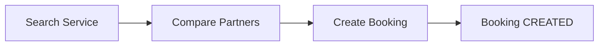

# Marketplace Foundation MVP

Sprint 2 delivers the smallest sellable DxCon marketplace layer for the patient journey:

**Search Service → Choose Partner → Create Booking**

Payment, AI, HL7, LIS, billing, wallet, CRM, and advanced dashboards are out of scope for this sprint.

## Business goal

Enable patients to discover diagnostic services from verified partners, compare price and turnaround, and create a booking record that downstream operations can fulfill.

## User journey

1. Patient opens marketplace search (`/marketplace` or API).
2. Patient filters by location, service name, partner type, home collection, and price.
3. Results show partner trust score, rating, ETA, and recommendation reason.
4. Patient selects a result and creates a booking.
5. Ops team views bookings in `/marketplace/bookings`.



## Data model summary

| Model | Purpose |
|-------|---------|
| DiagnosticCategory | Master catalog grouping |
| DiagnosticService | Canonical diagnostic service definition |
| ServicePackage | Bundled screening packages |
| ServicePackageItem | Services included in a package |
| PartnerServiceMapping | Partner-specific price, ETA, availability |
| MarketplaceBooking | Patient booking skeleton |

`Partner` and existing Partner Platform APIs remain unchanged. Marketplace search uses `PartnerServiceMapping` instead of duplicating `PartnerService`.

### MarketplaceBooking status

| Status | Meaning |
|--------|---------|
| CREATED | Booking captured, awaiting confirmation |
| CONFIRMED | Accepted by partner/ops |
| CANCELLED | Cancelled by patient or ops |
| ASSIGNED | Assigned for collection/processing |
| COMPLETED | Service fulfilled |

## API summary

Base path: `/api/v1/marketplace`

| Method | Path | Description |
|--------|------|-------------|
| GET | `/search` | Search partner/service offerings |
| POST | `/bookings` | Create booking |
| GET | `/bookings` | List bookings |
| GET | `/bookings/<booking_id>` | Booking detail |

### Search filters

| Param | Description |
|-------|-------------|
| `q` | Service or partner text search |
| `province` | Province filter |
| `city` | City filter |
| `district` | District filter |
| `partner_type` | LABORATORY, CLINIC, HOSPITAL, etc. |
| `home_collection` | `true` / `false` |
| `max_price` | Maximum mapped price |
| `sort` | `relevance`, `price_asc`, `price_desc`, `rating_desc`, `turnaround_asc` |

### Search result fields

Each result includes:

- `partner`
- `service`
- `price`
- `turnaround_hours`
- `rating`
- `review_count`
- `completed_orders`
- `trust_score`
- `recommendation_tags` (array, e.g. `DXCON_VERIFIED`, `FAST_RESULT`, `LOW_PRICE`)
- `recommendation_reason` (deprecated string derived from tags for backward compatibility)
- `availability` (partner capacity snapshot for search date)
- `book_url`

### Ranking engine

`RankingService` applies rule-based scoring using:

- Partner rating
- Completed orders
- Price competitiveness
- Turnaround time
- Home collection availability
- Partner workflow status
- Verification checklist completion
- Partner availability utilization (slight penalty when nearly full)

No AI is used.

### Partner availability

`PartnerAvailability` tracks daily partner capacity:

- `maximum_daily_capacity`
- `booked_count`
- `available_slots`
- `next_available_time`

Managed by `PartnerAvailabilityService`. Booking creation reserves a slot and ranking penalizes partners above 80% utilization.

### Booking timeline

`MarketplaceBookingTimeline` records operational milestones:

- CREATED
- CONFIRMED
- COLLECTOR_ASSIGNED
- COLLECTED
- IN_TRANSIT
- LAB_RECEIVED
- RESULT_READY
- COMPLETED

Every transition writes a timeline event via `MarketplaceBookingService.transition_booking()`.

API:

- `POST /api/v1/marketplace/bookings/<booking_id>/transition`
- `GET /api/v1/marketplace/bookings/<booking_id>/timeline`

### Booking create example

```json
POST /api/v1/marketplace/bookings
{
  "partner_service_mapping_id": "<mapping_id>",
  "patient_name": "Nguyen Van A",
  "patient_phone": "0901234567",
  "patient_email": "patient@example.com",
  "patient_address": "123 Nguyen Trai",
  "province": "Ha Noi",
  "city": "Ha Noi",
  "district": "Cau Giay",
  "requested_date": "2026-06-26",
  "requested_time_slot": "08:00-10:00",
  "note": "Fasting required"
}
```

Creates audit log `MARKETPLACE_BOOKING_CREATED` and event log `MARKETPLACE_BOOKING_CREATED`.

## Web UI

| Route | Description |
|-------|-------------|
| `/marketplace` | Search, filters, ranked result cards, book button |
| `/marketplace/book?mapping_id=` | Booking form |
| `/marketplace/bookings` | Booking list |
| `/marketplace/bookings/<booking_id>` | Booking detail |

## Architecture

```
API / Web routes
       ↓
MarketplaceSearchService / MarketplaceBookingService / RankingService
       ↓
Catalog + Partner models + audit/event logs
```

## Demo instructions

Seed realistic Vietnamese marketplace demo data:

```bash
cd backend
./venv/bin/python scripts/seed_marketplace_demo.py
```

Creates:

- 10 diagnostic categories
- 100 diagnostic services (including HbA1c, Glucose, ALT, AST, Creatinine, Lipid Panel, CBC, Vitamin D, TSH, CRP)
- 10 service packages
- 3 demo partners if fewer than 3 marketplace-ready partners exist
- Partner service mappings with price and ETA

Then open:

- Web: `http://localhost:5000/marketplace`
- API: `GET /api/v1/marketplace/search?q=HbA1c&city=Ha%20Noi`

## Verification

```bash
cd backend
./venv/bin/python scripts/verify_marketplace.py
./venv/bin/python -m unittest tests.test_marketplace -v
./venv/bin/python -m unittest tests.test_partner_platform -v
```

## Go-live checklist

- [ ] Run `seed_marketplace_demo.py` in staging
- [ ] Confirm at least 3 ACTIVE partners with verified checklist items
- [ ] Confirm search returns results for top 10 services in target cities
- [ ] Create test booking end-to-end via web and API
- [ ] Verify audit/event logs for booking creation
- [ ] Review partner SLA and rating fields on detail pages
- [ ] Smoke test existing Partner Platform APIs remain unchanged

## Files added

**Models**

- `backend/app/models/diagnostic_category.py`
- `backend/app/models/diagnostic_service.py`
- `backend/app/models/service_package.py`
- `backend/app/models/service_package_item.py`
- `backend/app/models/partner_service_mapping.py`
- `backend/app/models/marketplace_booking.py`

**Services**

- `backend/app/services/ranking_service.py`
- `backend/app/services/marketplace_search.py`
- `backend/app/services/marketplace_booking.py`

**API / Web**

- `backend/app/api/marketplace/routes.py`
- `backend/app/web/marketplace.py`

**Scripts / tests / docs**

- `backend/scripts/seed_marketplace_demo.py`
- `backend/scripts/verify_marketplace.py`
- `backend/tests/test_marketplace.py`
- `docs/marketplace/MARKETPLACE_MVP.md`

**Modified**

- `backend/app/core/statuses.py`
- `backend/app/models/partner.py` (optional `province` field)
- `backend/app/models/__init__.py`
- `backend/app/__init__.py`
- `backend/app/services/partner_platform.py` (province support)
