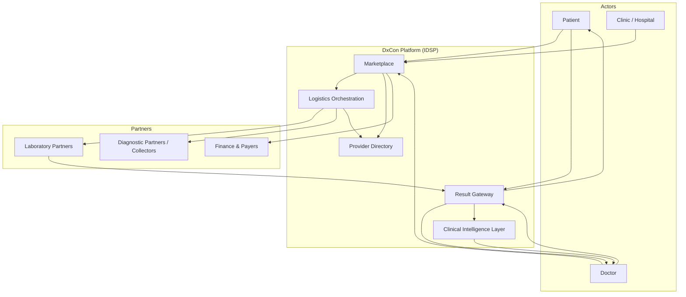
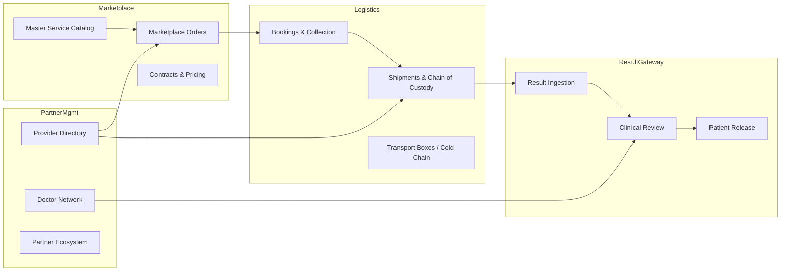

# RFC-0001 — DxCon Intelligent Diagnostic Services Platform

| Field | Value |
|---|---|
| **RFC ID** | RFC-0001 |
| **Title** | DxCon Platform Architecture Foundation |
| **Status** | Accepted (Architecture Baseline) |
| **Version** | 1.0.0 |
| **Date** | 2026-06-26 |
| **Authors** | DxCon Platform Architecture Board |
| **Supersedes** | Informal module-oriented design |
| **Related documents** | See [Architecture Index](#architecture-index) |

---

## 1. Abstract

This RFC establishes the **canonical architecture** for the DxCon Platform.

DxCon is **not** a Laboratory Information System (LIS). DxCon is an **Intelligent Diagnostic Services Platform (IDSP)** that orchestrates diagnostic commerce, logistics, clinical workflow, and result delivery across a **multi-sided partner ecosystem**.

The platform connects:

- **Patients** — consumers of diagnostic services
- **Doctors** — clinical ordering, review, and approval authority
- **Laboratories** — diagnostic execution partners (not platform owners)
- **Clinics & Hospitals** — care delivery organizations and referral sources
- **Diagnostic Partners** — collection networks, logistics operators, imaging centers, and B2B service integrators

Through three platform pillars:

1. **Marketplace** — discovery, catalog, contracting, and order orchestration
2. **Logistics** — chain-of-custody, cold chain, field collection, and shipment integrity
3. **Result Gateway** — normalized result ingestion, clinical review, AI assistance, and governed release to patients

---

## 2. Motivation

### 2.1 Problem statement

Healthcare markets lack a neutral platform layer that:

- Separates **service discovery and ordering** from **lab execution**
- Maintains **specimen integrity** across partners
- Delivers **clinically governed results** to the right actor at the right time
- Supports **B2B contracts** between enterprises without rebuilding integrations per partner

Legacy approaches treat diagnostics as a single-lab software problem. DxCon treats diagnostics as a **networked service economy**.

### 2.2 Platform positioning

| DxCon **is** | DxCon **is not** |
|---|---|
| Diagnostic services marketplace | Laboratory Information System (LIS) |
| Logistics & chain-of-custody orchestrator | Sample processor or analyzer controller |
| Result gateway & clinical release gate | EMR/EHR replacement |
| Partner integration hub | Single-tenant lab admin tool |
| AI-assisted interpretation layer | Autonomous diagnostic decision system |

Laboratories **plug into** DxCon. DxCon does **not** replace laboratory operational systems where they exist; it coordinates orders, logistics, and result exchange at the network boundary.

---

## 3. Architectural principles

| # | Principle | Implication |
|---|---|---|
| P1 | **Platform neutrality** | No partner type owns the canonical patient or order record exclusively. |
| P2 | **Services own business logic** | HTTP routes are thin adapters; state transitions live in domain services. |
| P3 | **Chain-of-custody by default** | Every logistics state change produces audit, timeline, and event records. |
| P4 | **Clinical release is gated** | Results are not patient-visible until doctor/platform policy approves release. |
| P5 | **Catalog is canonical** | Tests/services are defined in Master Service Catalog, not per-lab ad hoc strings. |
| P6 | **Partner extensibility** | New partner types integrate via documented APIs and directory entries. |
| P7 | **Backward compatibility** | Public API contracts evolve with versioned deprecation, not breaking changes. |
| P8 | **Evidence over assertion** | GPS, temperature, timestamps, and actor identity accompany critical transitions. |
| P9 | **Least privilege** | Role-scoped access across patient, doctor, lab, logistics, and admin surfaces. |
| P10 | **Idempotent operations** | Retries must not duplicate compliance records or financial events. |

---

## 4. Context view (C4 Level 1)



---

## 5. Container view (C4 Level 2)

| Container | Responsibility | Current codebase anchor |
|---|---|---|
| **API Gateway** | REST `/api/v1/*`, auth, rate limits | Flask blueprints in `backend/app/api/` |
| **Web Portals** | Role-specific operator UI | Flask blueprints in `backend/app/web/` |
| **Domain Services** | Business rules, transactions | `backend/app/services/` (target state) |
| **Compliance Store** | AuditLog, EventLog, ShipmentTimeline | `backend/app/models/` |
| **Operational DB** | PostgreSQL transactional data | Render `dxcon-postgres` |
| **Mobile Clients** | Patient & field staff apps | `mobile/dxcon_mobile`, `dxcon_patient_app` |
| **Document Store** | Result files, evidence photos | `ResultFile` model (extend) |

---

## 6. Core domain boundaries



Detailed specifications:

| Document | Scope |
|---|---|
| [PARTNER_ECOSYSTEM.md](../architecture/PARTNER_ECOSYSTEM.md) | Partner types, roles, onboarding |
| [DOMAIN_MODEL_V2.md](../architecture/DOMAIN_MODEL_V2.md) | Canonical entities and relationships |
| [MARKETPLACE_ARCHITECTURE.md](../architecture/MARKETPLACE_ARCHITECTURE.md) | Catalog, orders, contracts |
| [LOGISTICS_CHAIN_OF_CUSTODY.md](../architecture/LOGISTICS_CHAIN_OF_CUSTODY.md) | Specimen logistics (existing) |
| [RESULT_GATEWAY.md](../architecture/RESULT_GATEWAY.md) | Result lifecycle and release |
| [DOCTOR_NETWORK.md](../architecture/DOCTOR_NETWORK.md) | Clinical network and approvals |
| [MASTER_SERVICE_CATALOG.md](../architecture/MASTER_SERVICE_CATALOG.md) | Service taxonomy |
| [PROVIDER_DIRECTORY.md](../architecture/PROVIDER_DIRECTORY.md) | Partner registry |

---

## 7. End-to-end diagnostic journey

```
Discover (Marketplace)
  → Order (Marketplace + Contract)
    → Schedule / Assign (Provider Directory)
      → Collect (Logistics / Diagnostic Partner)
        → Transport (Logistics / Shipment)
          → Execute (Laboratory Partner — external)
            → Ingest (Result Gateway)
              → Interpret (AI Layer — assistive)
                → Review (Doctor Network)
                  → Release (Result Gateway → Patient)
```

Each stage emits **compliance events** where patient safety or billing integrity is affected.

---

## 8. Integration model

### 8.1 Northbound (consumers)

| Consumer | Primary APIs | Auth |
|---|---|---|
| Patient mobile | `/api/v1/mobile`, `/api/v1/patient` | JWT (patient scope) |
| Doctor portal | Web + future `/api/v1/doctor` | Session / JWT |
| Clinic EMR (future) | FHIR-adjacent REST (planned) | mTLS + OAuth2 |
| Partner B2B | `/api/v1/companies`, contracts | API key + JWT |

### 8.2 Southbound (partners)

| Partner | Integration pattern |
|---|---|
| Laboratory | Result file upload, status webhooks, catalog sync |
| Diagnostic partner | Collector workflow API, shipment accept/start |
| Logistics IoT | Transport box telemetry (temperature, GPS) |
| Payment | Invoice/payment APIs |

DxCon exposes **orchestration APIs**. Partners retain operational sovereignty within their domain.

---

## 9. Security and compliance architecture

| Layer | Control |
|---|---|
| Identity | Unified `User` with role claims; partner-scoped tokens (target) |
| Authorization | RBAC: PATIENT, DOCTOR, COLLECTOR, LAB, LOGISTICS, ADMIN |
| Audit | `AuditLog` for security-sensitive actions |
| Chain of custody | `ShipmentTimeline` + `EventLog` + QR evidence |
| Clinical governance | Doctor approval before patient release (Result Gateway) |
| Data residency | PostgreSQL on Render; extend for regional deployment |

See [ENGINEERING_BACKLOG.md](../ENGINEERING_BACKLOG.md) P0 items for current implementation gaps.

---

## 10. Technology baseline

| Layer | Standard |
|---|---|
| Runtime | Python 3.9, Flask 3.x |
| Persistence | SQLAlchemy 2.x, PostgreSQL |
| Mobile | Flutter |
| Deployment | Render (API + Postgres) |
| CI | GitHub Actions (backend) |

Target evolution (not in scope of RFC-0001 implementation):

- Alembic migrations
- API versioning (`/api/v2` for breaking changes only)
- Event bus for partner webhooks
- FHIR result bundles for EMR integration

---

## 11. Mapping from current codebase

The existing monolith **anticipates** RFC-0001 domains but does not yet fully enforce boundaries:

| RFC domain | Current modules | Maturity |
|---|---|---|
| Marketplace | `orders`, `contracts`, `test_catalogs`, `companies` | Functional, needs catalog centralization |
| Logistics | `shipments`, `collector_workflow`, `transport_boxes` | FP-003 in progress |
| Result Gateway | `test_results`, `result_files`, `doctor_portal` | Partial; release gate not enforced at API |
| Provider Directory | `laboratories`, `drivers`, `companies` | Fragmented |
| Doctor Network | `doctor_portal`, `doctor_kpi` | Web-only |
| AI Layer | `ai_*` routes, `clinical_summary` | Rule-based assist; not clinical authority |

RFC-0001 is the **target architecture**. Incremental refactors align the codebase without re-platforming.

---

## 12. Non-goals

- Replacing laboratory analyzers or LIS workflows inside partner labs
- Storing full EMR clinical records
- Autonomous AI diagnosis without physician oversight
- Real-time streaming analytics platform (Phase 3+)
- Multi-region active-active in v1

---

## 13. Decision log

| ID | Decision | Rationale |
|---|---|---|
| ADR-001 | Platform is IDSP, not LIS | Enables multi-partner marketplace model |
| ADR-002 | Three pillars: Marketplace, Logistics, Result Gateway | Clear bounded contexts and team ownership |
| ADR-003 | Master Service Catalog is system of record for test definitions | Prevents catalog fragmentation |
| ADR-004 | Result release requires clinical gate | Patient safety and regulatory alignment |
| ADR-005 | Monolith-first with service extraction | Matches current team size and deployment model |
| ADR-006 | QR-based chain-of-custody | Field-proven in existing logistics module |

---

## 14. Architecture index

| Document | Path |
|---|---|
| Partner Ecosystem | [PARTNER_ECOSYSTEM.md](../architecture/PARTNER_ECOSYSTEM.md) |
| Domain Model v2 | [DOMAIN_MODEL_V2.md](../architecture/DOMAIN_MODEL_V2.md) |
| Marketplace | [MARKETPLACE_ARCHITECTURE.md](../architecture/MARKETPLACE_ARCHITECTURE.md) |
| Logistics | [LOGISTICS_CHAIN_OF_CUSTODY.md](../architecture/LOGISTICS_CHAIN_OF_CUSTODY.md) |
| Result Gateway | [RESULT_GATEWAY.md](../architecture/RESULT_GATEWAY.md) |
| Doctor Network | [DOCTOR_NETWORK.md](../architecture/DOCTOR_NETWORK.md) |
| Master Service Catalog | [MASTER_SERVICE_CATALOG.md](../architecture/MASTER_SERVICE_CATALOG.md) |
| Provider Directory | [PROVIDER_DIRECTORY.md](../architecture/PROVIDER_DIRECTORY.md) |
| Engineering Backlog | [ENGINEERING_BACKLOG.md](../ENGINEERING_BACKLOG.md) |
| Repository Assessment | [REPOSITORY_ASSESSMENT.md](../REPOSITORY_ASSESSMENT.md) |

---

## 15. Approval and revision history

| Version | Date | Author | Changes |
|---|---|---|---|
| 1.0.0 | 2026-06-26 | Platform Architecture | Initial RFC-0001 baseline |

**Next review:** Upon completion of FP-003 and P0 security backlog items.

---

*RFC-0001 defines architecture only. Implementation follows phased delivery per ENGINEERING_BACKLOG.md.*
