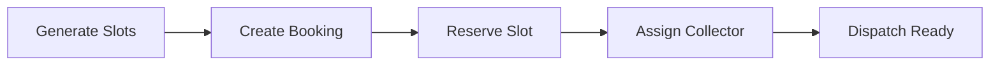

# Scheduling Engine MVP

Sprint 3 delivers real-world booking scheduling before Collector Dispatch. A patient booking is matched against partner availability, service capacity, operating hours, and time slots.

## Business goal

Ensure marketplace bookings can only consume valid partner capacity and scheduled windows, while preparing collector assignment for downstream dispatch workflows.

## User journey

1. Ops generates partner slots for the next 7 days.
2. Patient searches marketplace and selects a service.
3. Booking is created with optional `slot_id` validation.
4. Scheduling reserves partner slot and capacity.
5. Ops assigns a collector based on availability.
6. Booking timeline records each scheduling milestone.



## Data model

| Model | Purpose |
|-------|---------|
| SchedulingCalendar | Calendar owned by partner, doctor, collector, lab, or system |
| SchedulingSlot | Bookable time window with capacity |
| PartnerCapacity | Daily service-type capacity limits |
| CollectorAvailability | Collector job capacity by date and area |
| BookingAssignment | Links booking to collector and scheduled slot |

`MarketplaceBooking` extended with optional `scheduled_slot_id` for backward compatibility.

## API summary

Base path: `/api/v1/scheduling`

| Method | Path | Description |
|--------|------|-------------|
| GET | `/partners/<partner_id>/slots` | List available slots |
| POST | `/partners/<partner_id>/generate-slots` | Generate 7-day slots |
| POST | `/bookings/<booking_id>/reserve-slot` | Reserve slot for existing booking |
| POST | `/bookings/<booking_id>/assign-collector` | Assign collector manually |
| GET | `/collectors/availability` | List collector availability |

### Marketplace integration

Booking create accepts optional `slot_id`:

- Validates slot against partner operating hours and capacity
- Writes timeline event `SLOT_RESERVED`
- Preserves existing booking flow when `slot_id` is omitted

Assignment flow writes:

- `COLLECTOR_ASSIGNMENT_PENDING`
- `COLLECTOR_ASSIGNED`

Booking status remains backward compatible (`CREATED`, `ASSIGNED`, etc.).

## Services

| Service | Responsibility |
|---------|----------------|
| SchedulingService | Slot listing, operating-hour checks, capacity checks, reserve/release |
| SlotGenerationService | Generate partner slots and collector availability |
| BookingAssignmentService | Manual collector assignment, slot reservation orchestration |

## Web UI

| Route | Description |
|-------|-------------|
| `/scheduling` | Partner scheduling overview |
| `/scheduling/partners/<partner_id>` | Slots, capacity, bookings, assign collector |
| `/scheduling/collectors` | Collector availability list |

## Demo instructions

```bash
cd backend
./venv/bin/python scripts/seed_marketplace_demo.py
./venv/bin/python scripts/seed_scheduling_demo.py
```

Then open `/scheduling` and `/scheduling/collectors`.

## Verification

```bash
cd backend
./venv/bin/python scripts/verify_scheduling.py
./venv/bin/python scripts/verify_marketplace.py
./venv/bin/python scripts/verify_partner_platform.py
./venv/bin/python -m unittest tests.test_scheduling tests.test_marketplace tests.test_partner_platform -v
```

## Operational notes

- Slot generation is idempotent via unique constraints on calendar/date/time windows.
- Partner capacity and legacy `PartnerAvailability` both apply during booking.
- Collector assignment currently manual; service structure supports future auto-assignment.
- Every scheduling state change writes audit and event logs where applicable.

## Go-live checklist

- [ ] Seed marketplace and scheduling demo data in staging
- [ ] Generate 7-day slots for all ACTIVE partners
- [ ] Verify slot query API returns results for target cities
- [ ] Create booking with `slot_id` and confirm `SLOT_RESERVED` timeline
- [ ] Assign collector and confirm assignment timeline + audit logs
- [ ] Smoke test marketplace search/booking without `slot_id`
- [ ] Confirm Partner Platform APIs unchanged

## Files

**Models**

- `backend/app/models/scheduling_calendar.py`
- `backend/app/models/scheduling_slot.py`
- `backend/app/models/partner_capacity.py`
- `backend/app/models/collector_availability.py`
- `backend/app/models/booking_assignment.py`

**Services**

- `backend/app/services/scheduling.py`
- `backend/app/services/slot_generation.py`
- `backend/app/services/booking_assignment.py`

**API / Web**

- `backend/app/api/scheduling/routes.py`
- `backend/app/web/scheduling.py`

**Scripts / tests / docs**

- `backend/scripts/seed_scheduling_demo.py`
- `backend/scripts/verify_scheduling.py`
- `backend/tests/test_scheduling.py`

**Modified**

- `backend/app/core/statuses.py`
- `backend/app/models/marketplace_booking.py`
- `backend/app/models/__init__.py`
- `backend/app/services/marketplace_booking.py`
- `backend/app/__init__.py`
