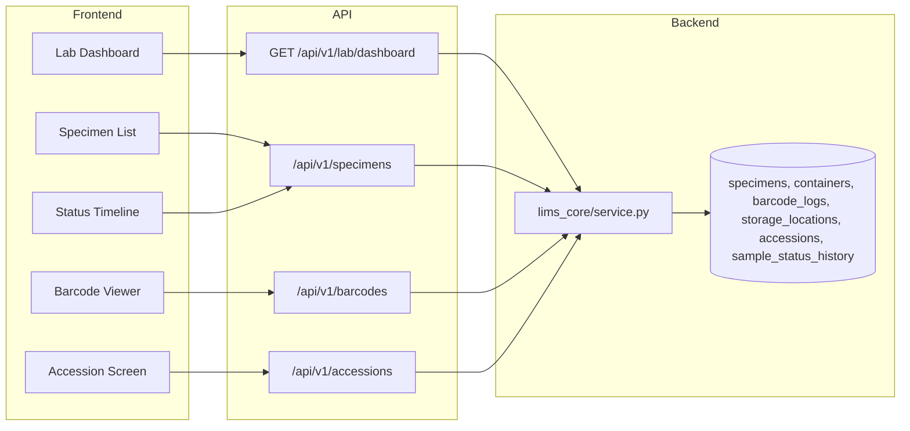

# Release 7.0 — Sprint 3: LIMS Core

## Objective

Production-grade Laboratory Information Management System (LIMS) on top of the existing DxCon platform. **No breaking changes** to `lab_workspace` (`/api/v1/lab/workspace/*`).

## Architecture



## Specimen lifecycle

| Status | Description |
|--------|-------------|
| CREATED | Specimen registered, barcode assigned |
| COLLECTED | Sample collected |
| IN_TRANSIT | En route to lab |
| RECEIVED | Arrived at laboratory |
| ACCESSIONED | Accessioned into storage |
| PROCESSING | On analyzer |
| QC | Quality control |
| VALIDATING | Awaiting validation |
| REPORTED | Results reported |
| ARCHIVED | Closed |

Every transition is stored in `sample_status_history`.

## Barcode engine

- Pattern: `DXYYYYMMDD000001` (human readable, Code128)
- QR payload: `DXCON|SPECIMEN|{human_readable}`
- Unique constraints on `barcode_logs.barcode_value` and `specimens.human_readable`

## Container types

`blood_edta`, `serum`, `plasma`, `urine`, `saliva`, `swab`

## Database migration

Apply `backend/migrations/016_lims_core.sql` on PostgreSQL (additive, idempotent).

## API summary

| Method | Path | Purpose |
|--------|------|---------|
| GET | `/api/v1/lab/dashboard` | Realtime LIMS KPI dashboard |
| GET/POST | `/api/v1/specimens` | List / create specimens |
| GET/PUT | `/api/v1/specimens/{id}` | Read / update specimen |
| POST | `/api/v1/specimens/{id}/transition` | Lifecycle transition |
| GET | `/api/v1/specimens/{id}/timeline` | Status history |
| GET/POST | `/api/v1/barcodes` | Verify / generate barcodes |
| GET/POST | `/api/v1/accessions` | List / create accession |
| GET | `/api/v1/accessions/{id}` | Accession detail |

Auth: same lab roles as Sprint 007 (`lab_api_read` / `lab_api_write`).

## Verification

```bash
cd backend && python3 -m unittest tests.test_lims_core -v
python3 scripts/verify_lims_core.py
cd ../apps/web && npm run typecheck && npm run test && npm run build
```

## OpenAPI

Regenerate after deploy:

```bash
cd backend && python3 scripts/generate_sdk.py
```

New routes appear automatically in `generated_api/openapi.yaml`.
